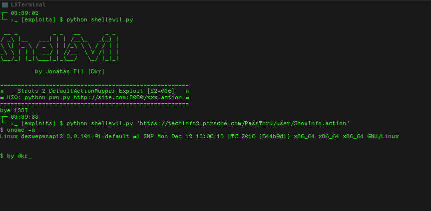

# ShellEvil

- Jonatas Fil (Dkr) 
- Julio Della Flora 
- Thiago Sena (THX)

Struts 2 DefaultActionMapper Interactive Shell Exploit for CVE-2013-225  [S2-016]

The Struts 2 DefaultActionMapper supports a method for short-circuit navigation state changes by prefixing parameters with
"action:" or "redirect:", followed by a desired navigational target expression. This mechanism was intended to help with
attaching navigational information to buttons within forms.

https://struts.apache.org/docs/s2-016.html

```USO: python pwn.py http://site.com:8080/xxx.action```

# Demo


`(porshe owned :p)`
