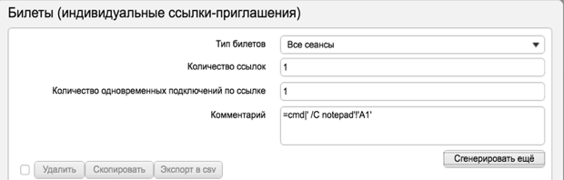
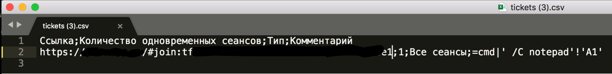

# CVE-2020-25398
CSV Injection exists in InterMind iMind Server through 3.13.65 via the csv export functionality.
# Information

Description: Attacker can configure specific data, which could be exported to malicious csv file with code execution payload and runs after opening on user's machine.

Researcher: Andrey Skuratov (https://github.com/h3llraiser/)

Issue date: 2020-07-06 (Initial Advisory)

Public release:

VEL Link: Info will be soon

NIST CVE Link: Info will be soon

# Screenshots:

