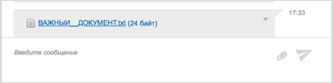
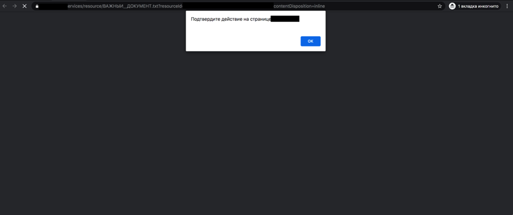

# CVE-2020-25399
Stored XSS in InterMind iMind Server through 3.13.65 allows any user to hijack another user's session by sending a malicious file in the chat.
# Information

Description: Attacker can send malicious file to any user using chat functional. File may contain js payload, which executes in victim's browser after file opens.

Researcher: Andrey Skuratov (https://github.com/h3llraiser/)

Issue date: 2020-07-06 (Initial Advisory)

Public release:

VEL Link: Info will be soon

NIST CVE Link: Info will be soon

# Screenshots:

