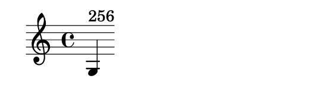

**CVEID**: CVE-2020-29007

**Name of the affected product(s) and version(s)**: Mediawiki Score (all versions up to 0.3.0)

**Problem type**: CWE-96: Improper Neutralization of Directives in Statically Saved Code (‘Static Code Injection’)

---

**Summary**

Score is a Mediawiki extension which generates musical notation based on user-provided Lilypond or ABC markup.
During our tests, we have determined it is vulnerable to remote code execution through Scheme code embedded in
Lilypond markup.

All version of Score (up to and including 0.3.0) allow the execution of arbitrary user-controlled code within
the context of a webserver process.
 
**Description**
 
Score extension generates musical notation by passing user-controlled Lilypond or ABC markup to a GNU Lilypond binary.
Because the binary is executed without the -dsafe option, it will execute arbitrary Guile Scheme code embedded within
Lilypond markup, including the code which interacts with operating system shell.

To exploit this vulnerability, the attacker must be able to edit any article on the vulnerable wiki.
In most configurations, it should be possible for the unauthenticated attacker.

**Reproduction**

1. Start editing any article on a wiki.

2. Replace the articles contents with the following code:
```
{{Image frame|content=\new Staff <<{g^#
(number->string(system "/usr/bin/false"))
}>>}}
```

3. Click ‘show preview’

4. If the output contains an image which looks like this, the wiki is vulnerable:

 
**Mitigation**

Disable Score extension.
