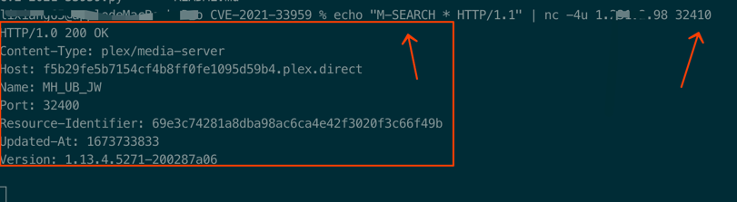

# CVE-2021-33959

It can be seen that Plex service listens to the four udp ports 32410, 32412, 32413 and 32414. Through the analysis of the attack payload and using the message format of the device query request for reference, we write software to send udp packets with the attack payload of M-SEARCH * HTTP/1.1 to these ports, and capture packets for the reflection source IP. Finally, we find that both 32410 and 32414 respond. The recurrence attack is shown in the following figure:

# send request

echo "M-SEARCH * HTTP/1.1" | nc -4u <ipaddress> 32410

# example

# Affected version
plex media server - 1.21 before

# Reference link

https://www.freebuf.com/articles/web/260338.html
