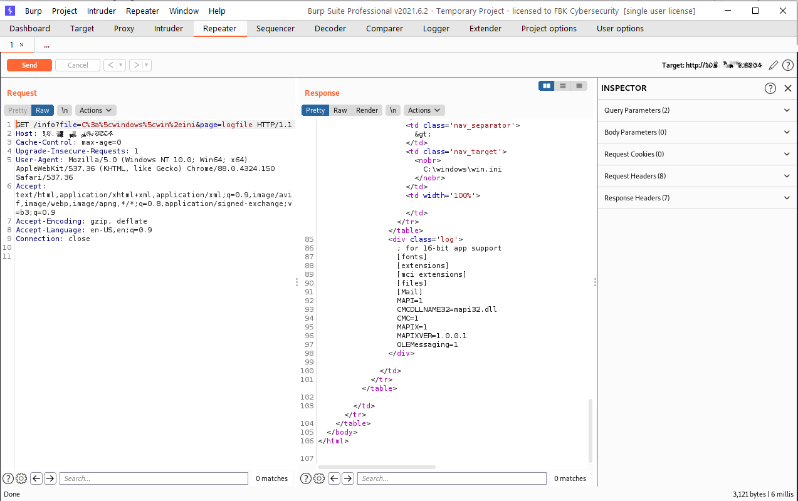
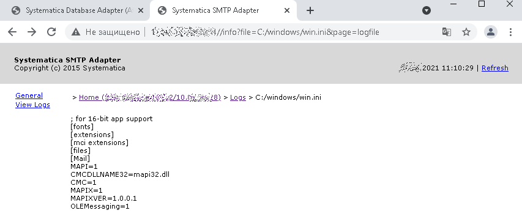

# CVE-2021-35975

Systematica SMTP Adapter versions prior to v2.0.1.101 are vulnerable to directory traversal, which may allow an attacker to read sensitive files.

CVSS v2: (AV:N/AC:L/Au:N/C:P/I:N/A:N)

CVSS v2 Score (BS): 3

CVSS v3: (AV:N/AC:L/PR:L/UI:N/S:U/C:L/I:N/A:N)

CVSS v3 Score (BS): 3.0

# Information

<b>Description:</b> Absolute path traversal vulnerability in the Systematica SMTP Adapter component (up to v2.0.1.101) in Systematica Radius (up to v.3.9.256.777) allows remote attackers to read arbitrary files via a full pathname in GET parameter "file" in URL. 

Also: affected components in same product - HTTP Adapter (up to v.1.8.0.15), MSSQL MessageBus Proxy (up to v.1.1.06), Financial Calculator (up to v.1.3.05), FIX Adapter (up to v.2.4.0.25)

<b>Class:</b> Design Error 

<b>Researcher:</b> Vadim Golovanov

<b>Issue date:</b> 2021-05-29 (Initial Advisory)

<b>Private release:</b> 2021-06-30

<b>Public release:</b> 2021-08-21

<b>Disclosure Link:</b>

<b>NIST CVE Link:</b>

<b>CWE:</b> 22 or 36 - Absolute Path Traversal

# POC

<b>An example of vector:<b/>
  
SMTP adapter              http://SERVER:PORT/info?page=logfile&file=C:/windows/win.ini
  
ALSO ACTUAL FOR:

HTTP adapter, MSSQL MessageBus Proxy, Financial Calculator, FIX Adapter and others...

<b>POST RE-FINDING CVE:<b/>

<b>CVE-2022-39838</b> https://github.com/jet-pentest/CVE-2022-39838
  
# Screenshots:
  

