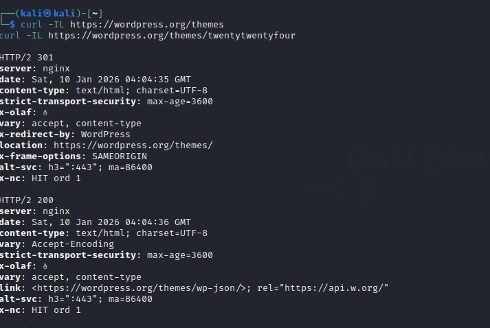

# CVE-2022-23779
CVE-2022-23779 is a security vulnerability in Zoho ManageEngine Desktop Central
It is classified as an information disclosure issue (CWE-200) where the software leaks internal server information to unauthorized users.

## Versions before 10.1.2137.8 are affected
### ::Medium severity

## Exploitation Details & Impact
Proof-of-concept code exists showing how an HTTP request (e.g., to /themes) could reveal the hostname via the Location header in redirects.

Leaking internal hostnames doesn’t itself allow takeover, but:It gives attackers network and server insight for profiling.
Useful internal identifiers help in targeted attacks or lateral movement planning.


Example request (curl):

```bash
curl -ILk https://IP:port/themes
```

## What this command does

-I → Fetches only HTTP headers (no body)

-L → Follows redirects

-k → Ignores SSL certificate validation

/themes → A path that triggers an HTTP redirect on vulnerable versions

If the server is vulnerable, the response headers may look like one of these:

```http
HTTP/1.1 302 Found
Location: https://INTERNAL-HOSTNAME:port/themes/
```


## Patched / Not vulnerable behavior

On a fixed version, you’ll see something like:


```http
HTTP/1.1 302 Found
Location: https://PUBLIC-IP:port/themes/
```

## Why /themes works

Internally, Desktop Central: Receives request to /themes ,Issues a redirect

Incorrectly uses the server’s internal hostname instead of the public-facing address

This was fixed in Desktop Central 10.1.2137.8+.

## Example


