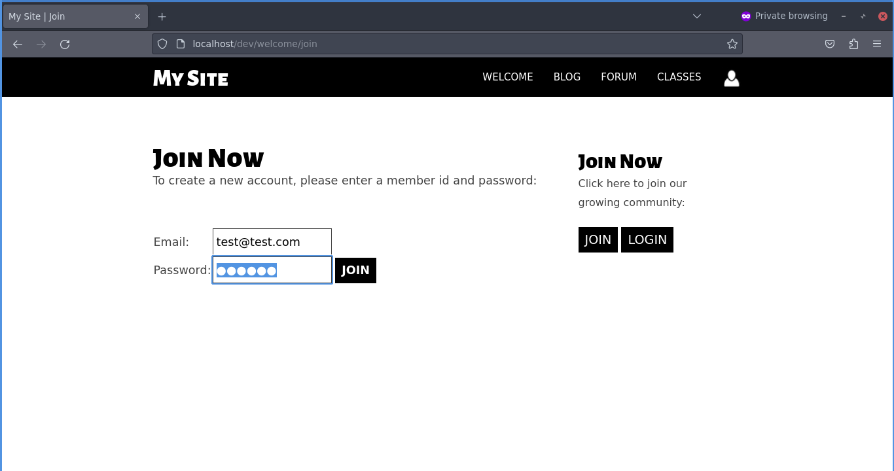
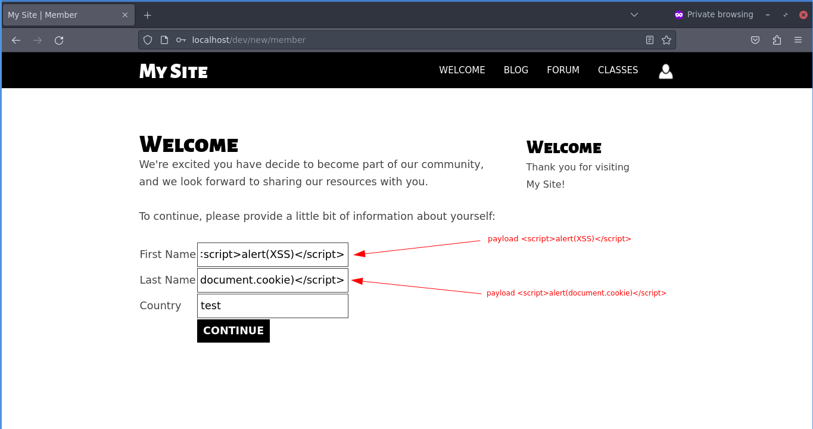
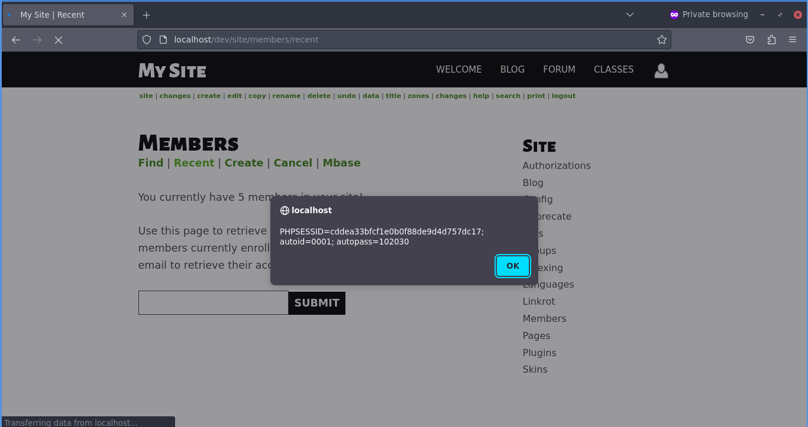

# CVE-2022-24227 [Updated] - BoltWire v8.00 - Stored Cross-site Scripting (XSS)

## Description
_CVE-2022-24227 [Updated]_: In version **8.00 of BoltWire CMS**, the `First Name` and `Last Name` fields on the member registration completion page are also vulnerable to stored cross-site scripting (XSS) attacks, just like version 7.10. This type of attack allows malicious scripts to be executed.

## Fix Suggestion
Sanitize user entries in these fields.

## Steps to Reproduce:

**1)** Create a new member.


**2)** On the next page, you will be asked to enter the new member’s `First Name`, `Last Name` and `Country`. Here, fill in `First Name:` and `Last Name:` with the following payloads:

`First Name`:
```js
<script>alert(XSS)</script>
```
`Last Name`:
```js
<script>alert(document.cookie)</script>
```


**3)** As a result, when the administrator goes to the _“Members”_ page and tries to list recent members, the payloads will be triggered.


**4)** To view other users' passwords, simply change the _“admin”_ parameter in the URL provided above to another user's name, for example `member.user`.

### Reference
* [CVE-2022-2427 - Details](https://www.cvedetails.com/cve/CVE-2022-24227/)