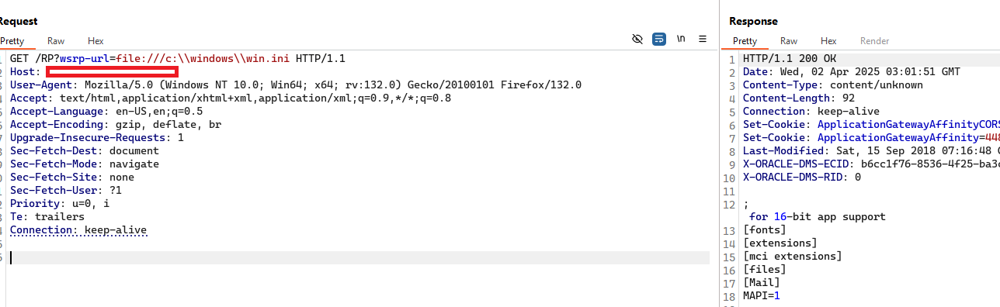
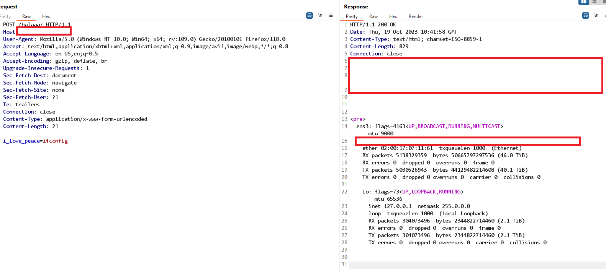

## Description:
- CVE-2023-22047 is unauthentication read file on oracle-peoplesoft. However, advance exploit attacker can use this vulnerability to execute remote code execution.

- In the peoplesoft application "Portal.war"," Serlet "WSRP Consumer ResourceProxy" enables the ability to read files and make request (SSRF) to any host.

- With this vulnerability, attackers can easily achieve Remote Code Execution (RCE) on the affected server, indicating that the actual severity exceeds the assigned CVSS score.

## Step to Exploit

```
https://peoplesoft.local:8443/RP?wsrp-url=file:///etc/passwd
https://peoplesoft.local:8443/RP?wsrp-url=file:///c:\\windows\\win.ini
```

```bash
echo target | nuclei -t CVE-2023-22047.yaml
```



## Step to RCE:
- By default, Oracle PeopleSoft enables the RESTful Management Services on WebLogic. Therefore, leveraging the SSRF vulnerability, attackers can easily retrieve full HTTP responses, ultimately allowing them to achieve Remote Code Execution (RCE).

- Step 1:  Read `SerializedSystemIni.dat` and `credentials` of weblogic server. Decypt it  to get raw secret.

- Step 2: Use `RESTAPI Management` to deploy webshell to weblogic





## Old story:
- Initially, I submitted this vulnerability to ZDI, but unfortunately, they weren't interested in this product 🥲. After a long time, I reported it directly to Oracle, but it was marked as a duplicate of CVE-2023-22047.

- Despite its CVSS score of only 7.5, this vulnerability is extremely critical, as attackers can exploit it to achieve unauthenticated Remote Code Execution (RCE).

