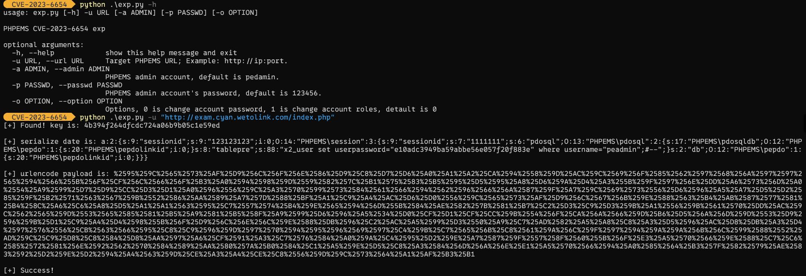

# CVE-2023-6654

PHPEMS Cookie反序列化漏洞，利用此漏洞可以通过反序列化修改SQL语句，通过SQL注入修改任意存在用户的密码或权限，默认管理员账号为peadmin

## Fofa指纹

# app="PHPEMS"

## 工具利用

`python exp.py -u http://127.0.0.1:1111`

`-u 参数指定PHPEMS的URL地址`

`-a 参数指定用户名，默认为PHPEMS默认管理员账号peadmin`

`-p 参数指定要修改的密码，默认为123456`

`-o 参数指定选项，0选项修改指定账号的密码，1选项修改指定账号的权限为管理员，默认修改指定账号的密码，不过还是推荐1选项`

exp：

## 免责声明

由于传播、利用此文所提供的信息而造成的任何直接或者间接的后果及损失，均由使用者本人负责，作者不为此承担任何责任。
