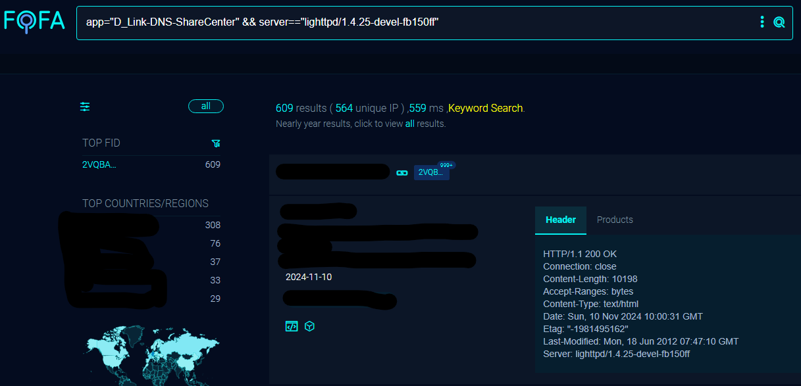
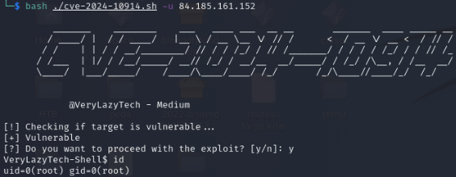

# POC - CVE-2024–10914- Command Injection Vulnerability in `name` parameter for D-Link NAS

[](https://buymeacoffee.com/verylazytech/extras)
[](https://medium.com/@verylazytech)
[](https://github.com/verylazytech)
[](https://buymeacoffee.com/verylazytech)

## Overview

A vulnerability was found in D-Link DNS-320, DNS-320LW, DNS-325 and DNS-340L up to 20241028. It has been declared as critical. Affected by this vulnerability is the function cgi_user_add of the file /cgi-bin/account_mgr.cgi?cmd=cgi_user_add. The manipulation of the argument name leads to os command injection. The attack can be launched remotely. The complexity of an attack is rather high. The exploitation appears to be difficult. The exploit has been disclosed to the public and may be used.

# Affected Devices

- DNS-320 Version 1.00
- DNS-320LW Version 1.01.0914.2012
- DNS-325 Version 1.01,  Version 1.02
- DNS-340L Version 1.08

# Affected Components

The vulnerability is localized to the `account_mgr.cgi` script, particularly in the handling of the `cgi_user_add` command. The `name` parameter in this script does not adequately sanitize input, allowing for command execution.

**Read about it** — [CVE-2024-10914](https://nvd.nist.gov/vuln/detail/CVE-2024-10914)

> **Disclaimer**: This Proof of Concept (POC) is made for educational and ethical testing purposes only. Usage of this tool for attacking targets without prior mutual consent is illegal. It is the end user’s responsibility to obey all applicable local, state, and federal laws. Developers assume no liability and are not responsible for any misuse or damage caused by this program.

## Getting Started

### Finding Targets

To find potential targets, use Fofa (similar to Shodan.io):

- **Fofa Dork**: `app="D_Link-DNS-ShareCenter" && server=="lighttpd/1.4.25-devel-fb150ff"`



### Cloning the Repository

First, clone the repository:

```bash
git clone https://github.com/verylazytech/CVE-2024-10914
```

Run the Exploit:

```bash
bash ./cve-2024-10914.sh -u <url>
```



