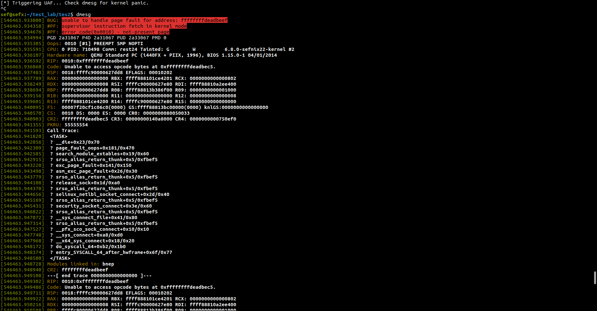

# CVE-2024-27398
CVE-2024-27398 POC

# Dmesg Output


## 📍 GDB Breakpoints
```gdb
GNU gdb (Ubuntu 12.1-0ubuntu1~22.04.2) 12.1
Copyright (C) 2022 Free Software Foundation, Inc.
License GPLv3+: GNU GPL version 3 or later <http://gnu.org/licenses/gpl.html>
This is free software: you are free to change and redistribute it.
There is NO WARRANTY, to the extent permitted by law.
Type "show copying" and "show warranty" for details.
This GDB was configured as "x86_64-linux-gnu".
Type "show configuration" for configuration details.
For bug reporting instructions, please see:
<https://www.gnu.org/software/gdb/bugs/>.
Find the GDB manual and other documentation resources online at:
    <http://www.gnu.org/software/gdb/documentation/>.

For help, type "help".
Type "apropos word" to search for commands related to "word".
(gdb) file vmlinxsef680 
Reading symbols from vmlinxsef680...
(gdb) target remote :1234
Remote debugging using :1234

(gdb) i b
Num     Type           Disp Enb Address            What
50      breakpoint     keep y   0xffffffff81e22640 in sco_sock_connect at net/bluetooth/sco.c:569
	breakpoint already hit 2 times
51      breakpoint     keep y   0xffffffff81e236e0 in sco_sock_release at net/bluetooth/sco.c:1237
	breakpoint already hit 2 times
52      breakpoint     keep y   0xffffffff81e22ef0 in sco_conn_del at net/bluetooth/sco.c:182

(gdb) p sock->sk
$224 = (struct sock *) 0xffff88810a2ee400
(gdb) x/gx 0xffff88810a2ee400 + 0x2a8
0xffff88810a2ee6a8:	0xffffffff81bd3390
(gdb) c
Continuing.

Thread 1 hit Breakpoint 38, sco_sock_connect (sock=0xffff88810d28d040, addr=0xffffc9000062fe80, alen=8, flags=2050) at net/bluetooth/sco.c:569
569		release_sock(sk);
(gdb) x/gx 0xffff88810a2ee400 + 0x2a8 // obj 1 offset
0xffff88810a2ee6a8:	0xffffffff81bd3390
(gdb) x/gx 0xffff88810a2ee400 + 0x2a8 // 
0xffff88810a2ee6a8:	0xffffffff81bd3390
(gdb) x/gx 0xffff88810a2ee400 + 0x2b0 // obj 2 offset
0xffff88810a2ee6b0:	0xffffffff81bd34b0
(gdb) x/gx 0xffff88810a2ee400 + 0x2a0 //obj 3 offset
0xffff88810a2ee6a0:	0xffffffff81bd17b0


