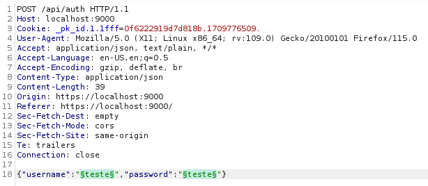
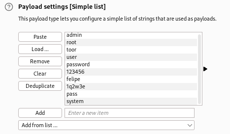
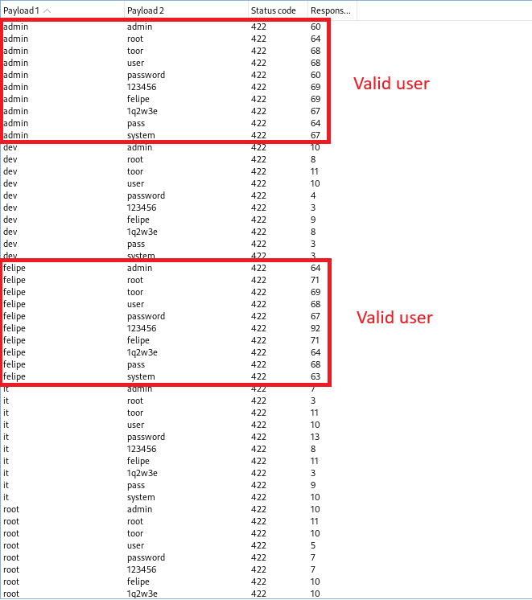

# CVE-2024-29296 - User enumeration on Portainer CE - 2.19.4

A user enumeration vulnerability was found in Portainer CE 2.19.4. This issue occurs during user authentication process, where a difference in response time could allow a remote unauthenticated user to determine if a username is valid or not.

This vulnerability has been fixed with issue [#11736](https://github.com/portainer/portainer/issues/11736) of Portainer, which was shipped with Portainer CE versions 2.19.5 and 2.20.2.

## Summary

- Vulnerability: User enumeration
- Vendor of Product: Portainer
- Affected Product Code Base: Portainer CE - 2.19.4
- Attack Type: Remote
- Impact Information Disclosure: True
- Attack Vectors: To exploit the vulnerability, someone must send several login requests for multiple usernames and check the response times. The response time for valid users is noticeably larger.
- Discoverer: Thayse Marques Solis
- CVSS:3.1/AV:N/AC:L/PR:N/UI:N/S:U/C:L/I:N/A:N (5.3)
- CWE-208: Observable Timing Discrepancy

## Proof of Concept

I discoverd this vulnerability while I tried to do a password spray  attack on the login page of a Portainer instance. I submitted multiple requests with varying usernames and passwords to the login form of the Portainer application.

Regardless of the user's existence, if the username + password combination is not correct, the backend of the Portainer application responds with the same HTTP status code. This conforms to the best approach to prevent - or hinder - attempts to enumerate valid users.

However, looking at the results of my password spray, I noticed that the login attempts to some usernames consistently take a certain mean time, while login attempts to other usernames consistently take a noticeably larger mean time.

The system has to check the validity of the password for existing users, but does not need to if the username is invalid in the first place. Therefore, I assumed that the noticeable change in mean login attempt time had relationship with that. I then proceeded to install a local copy of Portainer CE 2.19.4 and tried to replicate the behavior, to the same result.

This is the request format I sent. The username and password fields were selected to insert the payloads.

These were the users I inserted in the username field. For this test, only the "admin" and "felipe" users were valid. All other usernames on the list did not correspond to existing users. 

And these were the passwords I inserted in the password field.

A request was sent to the server for each unique username-password pair. The results are shown below.

When an username corresponds to an existing user, the login attempts consistently and noticeably take a larger amount of time when compared to login attempts for non-existing users.

This means that Portainer's system in that version is susceptible to enumeration of valid users - by looking at the time that the backend takes to respond to login attempts, an attacker is able to enumerate the users of the application.
