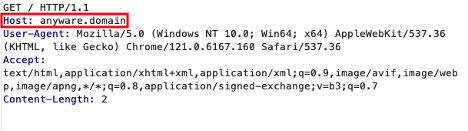
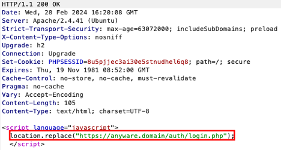

# CVE-2024-34328 Open Redirection via Host Header

## 📝 Overview

**Vulnerability Title**: Open Redirection via Host Header  
**Product**: Sielox AnyWare  
**Version Affected**: 2.1.2  
**CVE ID**: CVE-2024-34328
**Severity**: Medium  
**Attack Vector**: Remote  
**Impact**: Open Redirection / Phishing

---

## 🧨 Description

An attacker can craft a URL with a **modified `Host` header** that points to a malicious domain under their control. When users click the malicious link, they are redirected to the attacker's domain — potentially leading to **phishing**, **credential theft**, or **malware delivery**.

This vulnerability arises due to the application’s improper validation of the `Host` header when generating absolute URLs during redirection.

---

## 🖼️ Proof of Concept (PoC)

### 🔗 Modified Host Header Attack

Below are two images demonstrating the exploit process:

**Step 1**: Malicious URL crafted using the Host header  

**Step 2**: Victim is redirected to an attacker-controlled domain  

---

## 🛡️ Mitigation

- Validate and sanitize the `Host` header server-side.
- Use a fixed host value for redirection logic.
- Implement allow-lists for trusted redirect domains.
- Avoid dynamic redirects based on untrusted user input.

---

## 🔒 Impact

Successful exploitation may allow attackers to:
- Redirect users to phishing sites
- Bypass security filters that rely on host validation
- Abuse trust relationships between users and the original application

---

## 👨‍💻 Author

Security Researcher – Kevin Suckiel // 0xsu3ks

---

## ⚠️ Legal Note

This research is for **educational purposes and responsible disclosure**. The author is not liable for any misuse of this information.
