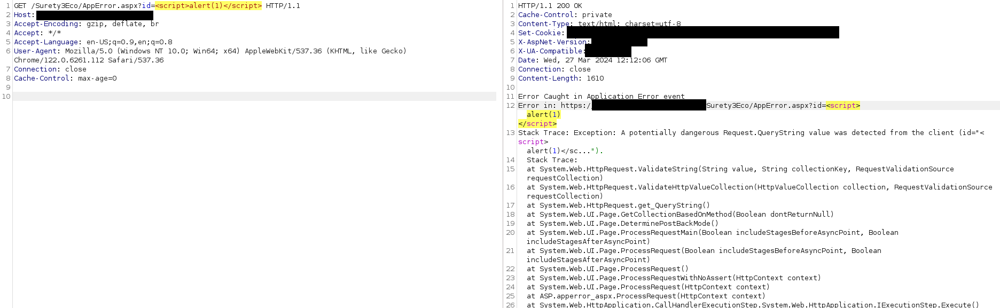
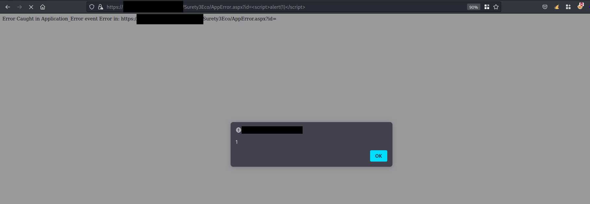

# Description
AML Surety Eco up to version 3.5 is affected by an un-authenticated reflected cross-site scripting.

The target web application handles error in a dedicated error page (accessible without any authentication) containing a URL parameter that is not sanitizing user input. The provided parameter value is reflected off the web application causing malicious payloads to execute JavaScript code on the victim’s browser.
# Risk
- Severity: Medium
- CVSS v3.1 Score: 5.4
- CVSS v3.1 Vector: [**AV:N/AC:L/PR:N/UI:R/S:U/C:N/I:L/A:L**](https://nvd.nist.gov/vuln-metrics/cvss/v3-calculator?vector=AV:N/AC:L/PR:N/UI:R/S:U/C:N/I:L/A:L&version=3.1)
# Affected Resources
- Version: up to AML Surety Eco v3.5
- https://<application-baseurl\>/Surety3Eco/AppError.aspx

The vulnerable parameter:
- `id`
# Evidence
It is possible to inject a JavaScript payload in the `id` URL parameter

Attacker can provide the URL with JavaScript payload to a victim that upon opening in the browser results in the execution of JavaScript code.

