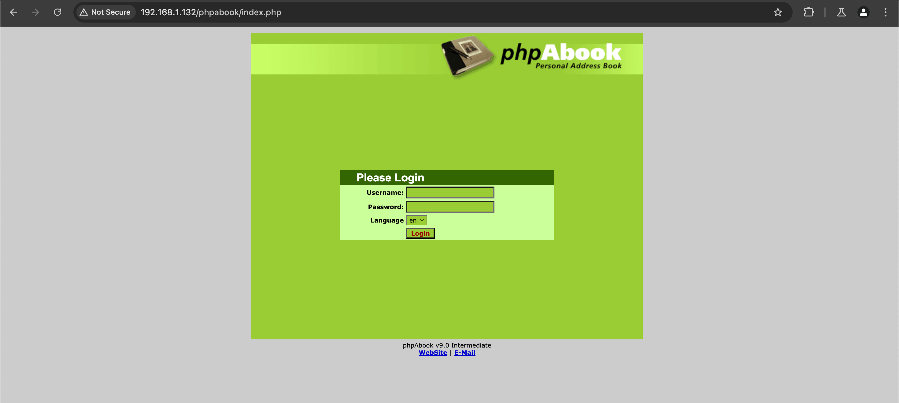
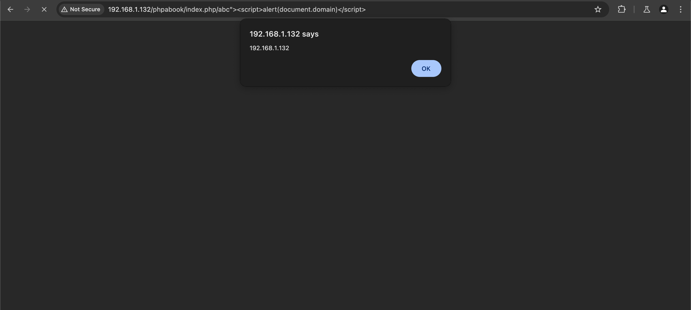
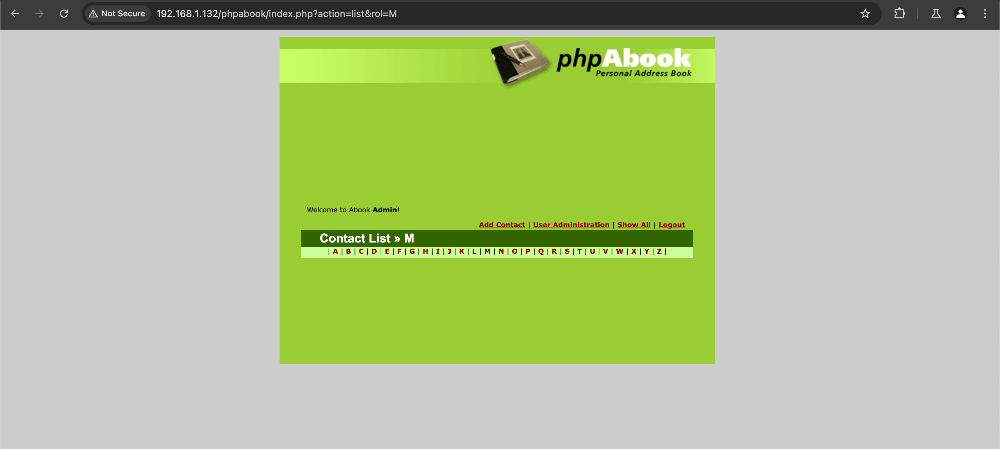
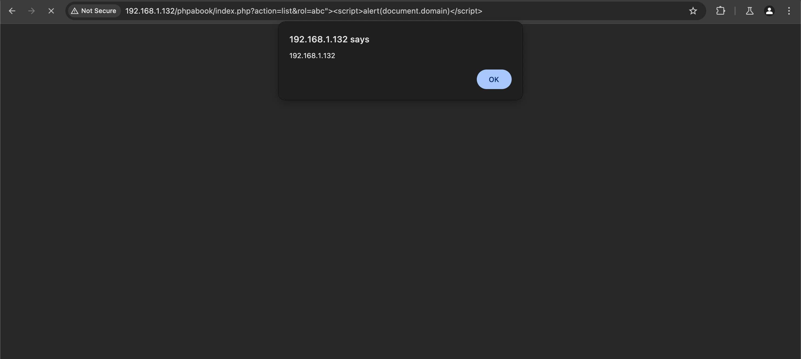

# phpAbook 9.0i - Cross-Site Scripting (XSS) Vulnerability (CVE-2024-48589)

---

**Summary:**

A **Cross-Site Scripting (XSS)** vulnerability was discovered in the `rol` parameter of `index.php` or the path section in the phpAbook application. This vulnerability allows an attacker to inject arbitrary JavaScript code into a user's browser, potentially leading to:

- Disclosure of sensitive information, including session cookies
- Unauthorized actions within the application context

The issue arises due to improper validation and sanitization of user-supplied input.

---

**Impact:**

An attacker can craft a URL with a malicious script in the `rol` parameter or path section and trick a user into visiting the link or execute the link directly in the browser.

---

Proof of Concept (PoC):

Access the index.php page of the phpabook application.


Append an XSS payload to the index.php URL. For example:
```
/abc"><script>alert(document.domain)</script>
```


Another vulnerable parameter is rol, which can be found in the "Show All" tab.


Inject the XSS payload into the rol parameter. For example:
```
rol=abc"><script>alert(document.domain)</script>
```

