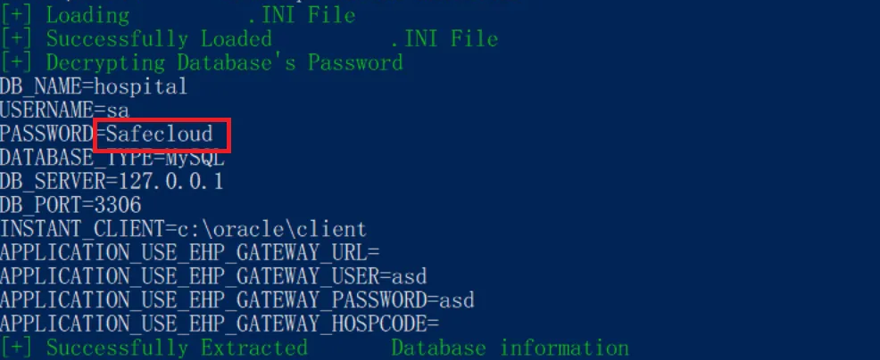

# CVE-2024-53522
**Exploit PoC for CVE-2024-53522**

This repository contains the Proof of Concept (PoC) for **CVE-2024-53522**, a vulnerability discovered by **Safecloud Co., Ltd.** For detailed information about the vulnerability, please refer to our blog post: [CVE-2024-53522: HOSxP Software 0day Discover & Exploitation](https://www.safecloud.co.th/researches/blog/CVE-2024-53522)

## Vulnerability Overview  
**CVE-2024-53522** is a critical security issue affecting **HOSxP XE** [https://hosxp.net/](https://hosxp.net/). This vulnerability allows a local attacker to decrypt the credentials of the priviledge database credential due to the use of **static hard-coded private key-IV** in the application.

## Disclaimer  
This PoC is provided for **educational and research purposes only**. Use of this PoC against unauthorized systems is strictly prohibited and may violate laws or agreements. The authors are not responsible for misuse or damages.
