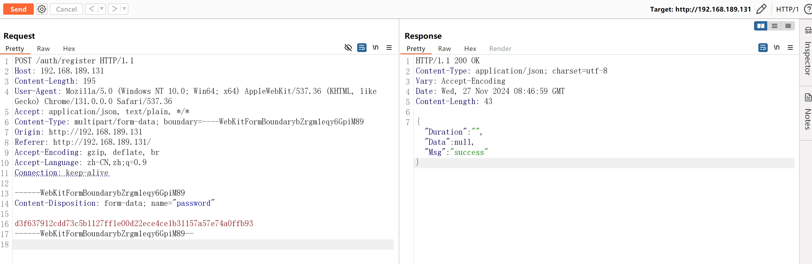

# Jrohy/trojan 未授权修改管理员密码


Jrohy/trojan 是一个基于 Go 开发的自动化部署 trojan 服务的开源项目，其 web 端初始化接口 `/auth/register` 在用户配置后未能正常关闭，导致未经授权的访问者可以直接修改管理员密码

项目地址：

- https://github.com/Jrohy/trojan

影响版本：

- v2.0.0 - v2.15.3


## 漏洞原理

注册路由，使用 `updateUser` 函数处理`/auth/register`请求

```go
// https://github.com/Jrohy/trojan/tree/v2.15.3/web/auth.go#L155

func Auth(r *gin.Engine, timeout int) *jwt.GinJWTMiddleware {
	jwtInit(timeout)

	newInstall := gin.H{"code": 201, "message": "No administrator account found inside the database", "data": nil}
	r.NoRoute(authMiddleware.MiddlewareFunc(), func(c *gin.Context) {
		claims := jwt.ExtractClaims(c)
		fmt.Printf("NoRoute claims: %#v\n", claims)
		c.JSON(404, gin.H{"code": 404, "message": "Page not found"})
	})
	...
	r.POST("/auth/register", updateUser)
```

从请求中提取`password`，传入`SetValue`

```go
// https://github.com/Jrohy/trojan/tree/v2.15.3/web/auth.go#L113

func updateUser(c *gin.Context) {
	responseBody := controller.ResponseBody{Msg: "success"}
	defer controller.TimeCost(time.Now(), &responseBody)
	username := c.DefaultPostForm("username", "admin")
	pass := c.PostForm("password")
	err := core.SetValue(fmt.Sprintf("%s_pass", username), pass)
	if err != nil {
		responseBody.Msg = err.Error()
	}
	c.JSON(200, responseBody)
}
```

更新数据库，写入新密码

```go
// https://github.com/Jrohy/trojan/tree/v2.15.3/core/leveldb.go#L30

func SetValue(key string, value string) error {
	db, err := leveldb.OpenFile(dbPath, nil)
	if err != nil {
		return err
	}
	defer db.Close()
	return db.Put([]byte(key), []byte(value), nil)
}
```


## 漏洞证明



