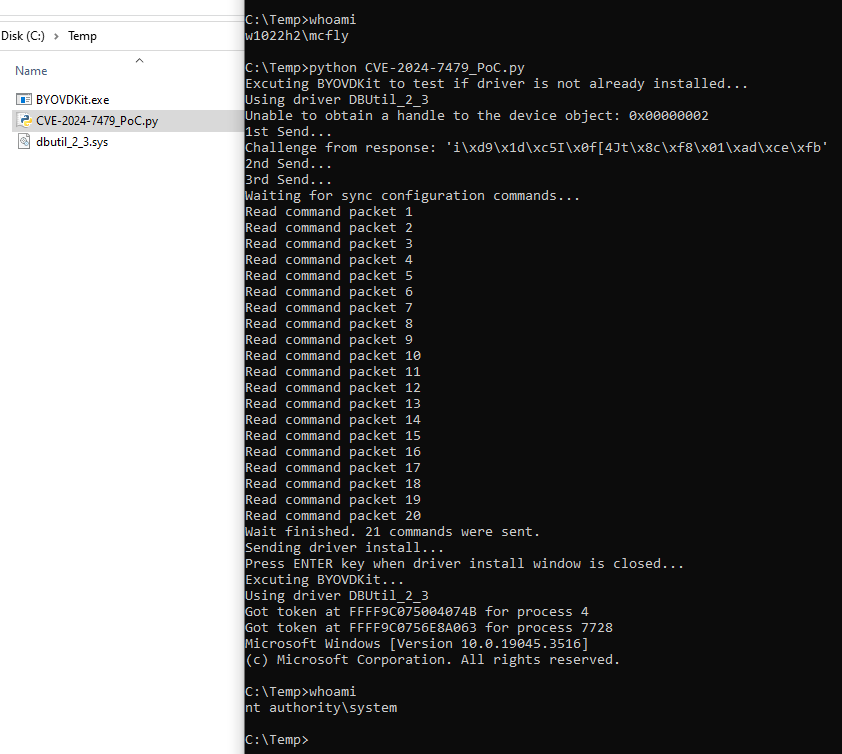

# CVE-2024-7479 TeamViewer Improper signature verification of driver installation

Author: [Marcos Accossatto](https://www.coresecurity.com/profile/marcos-accossatto)

For demonstration purposes only. Complete exploit works on vulnerable version on Team Viewer for Windows.

# Introduction
This exploit PoC is a python implementation of [Pedro Gabaldon's PoC for CVE-2024-7479](https://github.com/PeterGabaldon/CVE-2024-7479_CVE-2024-7481).

This script contain all the clases to handle the IPC protocol for the exploitation.

For the final exploitation, the [dbutil_2_3.sys driver](https://github.com/Hagrid29/BYOVDKit/tree/main/Drivers) and the compiled executable from the [BYOVDKit project](https://github.com/Hagrid29/BYOVDKit) must be present in the same local directory as this script.

This script was tested against TeamViewer 15.57.5.

# Script exploitation steps

This script will perform the following steps to exploit the vulnerability:

- Open a socket against **127.0.0.1** and port **5939**.
- Execute BYOVDKit.exe with the following command line to test if the driver is already installed:
**BYOVDKit.exe 1 token 4**
- Assemble the 1st IPC request via **getClientAuth** function and send it to server.
- Take the **response_challenge** from server response via **getServerChallengeFromResponse** function
- Concatenate **response_challenge** and a "secret" value, calculate its MD5 hash value and then use it to assemble the 2nd IPC request via **getClientAuth** function.
- Send the 2nd request to complete authentication.
- Get the PID of the python process, locate and extract the version of the **TeamViewer.exe** executable file, assemble the 3rd IPC request via **getControlRequest** function and send it to server.
- Read IPC packets from server until sync configuration is complete (21 packets is normal)
- Copy the **TeamViewerVPN.cat** file from the TeamViewer **x64** directory in the script directory.
- Copy the **TeamViewerVPN.inf** file from the TeamViewer **x64** directory in the script directory and rename as a random inf file.
- Rename the **dbutil_2_3.sys** file from the script directory as **TeamViewerVPN.sys**.
- Assemble the 3rd IPC request via **getInstallDriverRequest** function and send it to server.
- Wait until the user clicks the **Install this driver software anyway** button to complete the driver installation and press **ENTER**
- Delete all copied/created/renamed files (**TeamViewerVPN.cat**, **TeamViewerVPN.sys** and random **.inf** file)
- Execute BYOVDKit.exe with the following command line to launch a cmd a system:
**BYOVDKit.exe 1 token 4**

# Usage
- Run **cmd.exe** as a regular user.
- Use **whoami** to check username.
- Run the script with **python CVE-2024-7479_PoC.py**.
- When the install driver warning appears, click in the **Install this driver software anyway** message to install the driver.
- Go back to cmd window and press **ENTER** to continue with scripot execution.
- Use **whoami** to check that the username is **nt authority\system**.

# References
- [https://pgj11.com/posts/Finding-TeamViewer-0days-Part-1/](https://pgj11.com/posts/Finding-TeamViewer-0days-Part-1/)
- [https://pgj11.com/posts/Finding-TeamViewer-0days-Part-2/](https://pgj11.com/posts/Finding-TeamViewer-0days-Part-2/)
- [https://pgj11.com/posts/Finding-TeamViewer-0days-Part-3/](https://pgj11.com/posts/Finding-TeamViewer-0days-Part-3/)
- [https://github.com/PeterGabaldon/CVE-2024-7479_CVE-2024-7481](https://github.com/PeterGabaldon/CVE-2024-7479_CVE-2024-7481)

We hope you find it useful, if you have any doubt can contact us at marcos.accossatto@fortra.com

Enjoy!
