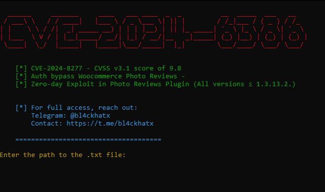

<h1 align="left">CVE-2024-8277 - Authentication Bypass in WooCommerce Photo Reviews by <a href="https://t.me/bl4ckhatx" target="_blank">
  @bl4ckhatx
  </a></h1>
### 
<h3 align="left">This is just a teaser. The full exploit’s for sale. Want to compromise thousands of sites? Hit me up. <a href="https://t.me/bl4ckhatx" target="_blank">
  @bl4ckhatx
  </a></h3>

### 

  

### 

<h2 align="left">🎯 CVE-2024-8277: WooCommerce Exploit - Contact: <a href="https://t.me/bl4ckhatx" target="_blank">
  @bl4ckhatx
  </a></h2>

### 

A critical authentication bypass vulnerability in WooCommerce Photo Reviews Premium, affecting all versions ≤ 1.3.13.2. Exploit the login function to impersonate administrators, gaining full control of WordPress sites. Fast, silent, and efficient.

### 

<h2 align="left">Overview - CVE-2024-8277</h2>

### 

This repository contains an exploit for CVE-2024-8277, which affects the WooCommerce Photo Reviews Premium plugin for WordPress. The exploit takes advantage of an authentication bypass due to improper validation in the login function. Attackers can impersonate any user, including administrators, who dismissed an admin notice in the last 30 days. This makes it easy for unauthorized access to be gained on vulnerable websites.

### 

<h3 align="left">For more details or to secure a customized exploit kit, reach out on Telegram: <a href="https://t.me/bl4ckhatx" target="_blank">
  @bl4ckhatx
  </a></h3>

### 

  

###
