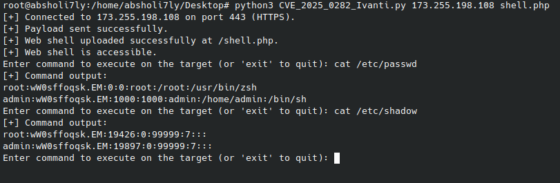

# CVE-2025-0282-Ivanti-exploit
CVE-2025-0282 is a critical vulnerability found in Ivanti Connect Secure, allowing Remote Command Execution (RCE) through a buffer overflow exploit.
This vulnerability enables attackers to upload malicious files (e.g., web shells) and execute commands on the target system with elevated privileges.
It is highly recommended to update affected systems to the latest version to mitigate the risk of exploitation.


## Uploading a Web Shell

To use the tool for uploading a web shell to the target system:
```
python3 CVE_2025_0282_Ivanti.py <target_ip> <local_shell_path>
```
* <target_ip>: The IP address of the target server.
* <local_shell_path>: Path to the web shell file on your local machine.

## Executing Remote Commands

After successfully uploading the web shell, the tool allows you to execute commands on the target system interactively.

<div align="center">
  
</div>
