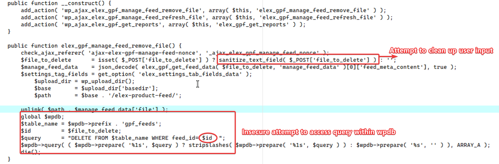

# CVE-2025-10046 - ELEX WooCommerce Google Shopping
**Author: Byte Reaper**

## Description
CVE-2025-10046 is a SQL injection vulnerability in the ELEX WooCommerce Google Shopping (Product Feed) plugin for WordPress, versions 1.4.3 and earlier.
The issue resides in the includes/elex-manage-feed-ajax.php file, where the file_to_delete parameter is not properly sanitized before being used in SQL queries.

Attack vector: Authenticated (Administrator)

Impact: An attacker with administrator privileges could inject arbitrary SQL statements, potentially leading to database information disclosure or tampering.

Severity: High (Requires administrator privileges, but may compromise database integrity).

## Requirements :
```
Linux x86_64
GCC 
```
## Code Logic (elex-manage-feed-ajax.php)


This image shows the code area in the `elex-manage-feed-ajax.php` file that is vulnerable to SQL injection. The `sanitize_text_field()` function is applied first to sanitize user input from suspicious HTML tags and ensure proper Unicode formatting, but this is not sufficient to prevent SQL injection. Next, a global `$wpdb` object is used to access the `gpf_feeds` table, and the code calls `$wpdb->query` directly without using properly prepared statements or other validation methods. The SQL statement `DELETE FROM $table_name WHERE feed_id= $id` executes user input on the database, and since `file_to_delete` is not strictly validated, this allows SQL injection to be effective.


## Build :
```
gcc exploit.c argparse.c -o CVE-2025-10046 -lcurl
./CVE-2025-10046 -u http://127.0.0.1 -v -c [Cookie file admin]
```

## References : 
- NVD : https://nvd.nist.gov/vuln/detail/CVE-2025-10046


## License : 

MIT


