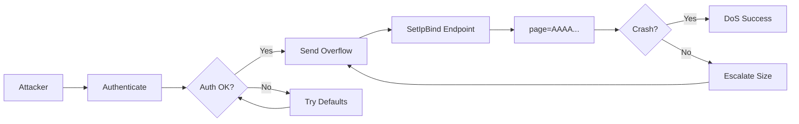

# CVE-2025-15177

**Tenda WH450 V1.0.0.18 Stack Buffer Overflow**

## Overview

Stack-based buffer overflow in `/goform/SetIpBind` endpoint allowing DoS or potential RCE.

| Field | Value |
|-------|-------|
| Product | Tenda WH450 |
| Version | V1.0.0.18 |
| Type | Stack Buffer Overflow |
| Vector | HTTP GET (authenticated) |
| Impact | DoS / Potential RCE |

## Attack Flow



## Usage

```bash
python exploit.py <target_ip>

python exploit.py 192.168.0.1

python exploit.py 192.168.0.1 --escalate

python exploit.py 192.168.0.1 -u admin -p admin -s 500
```

## Parameters

| Flag | Description | Default |
|------|-------------|---------|
| `-s, --size` | Payload size | 240 |
| `-u, --username` | Auth username | empty |
| `-p, --password` | Auth password | empty |
| `-t, --timeout` | Request timeout | 10 |
| `--escalate` | Try multiple sizes | off |

## Requirements

```
requests
```

## Disclaimer

For authorized security testing only.
