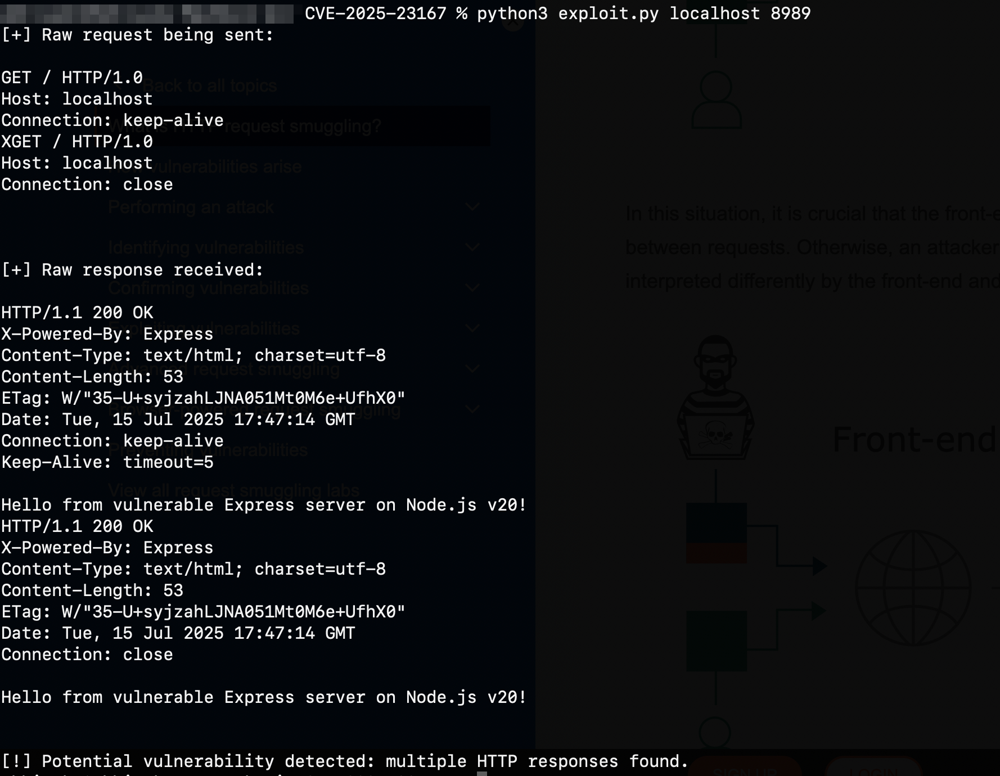

# CVE-2025-23167 – Node.js HTTP Request Smuggling Exploit

Working exploit for CVE-2025-23167, a request smuggling vulnerability affecting Node.js 20.x versions prior to v20.19.2. This bug allows improper HTTP header termination, enabling attackers to bypass proxy-based access controls.

## Files
- exploit.py – Python3-based Exploit for the vulnerability.
- lab.js – Simple Node.js server to simulate a vulnerable environment.

## Usage

### Exploit
To run the exploit script:
- Run, `python3 exploit.py <target-domain-or-ip> <port>`

### Sample Input & Output

### Lab Setup
To set up the test environment:
- Make sure you're using Node.js v20.19.1 or below.
- Install express (`npm install express`).
- Then run, `node lab.js` to run the server.
- The server will be available at http://localhost:8989 (or your chosen port).
