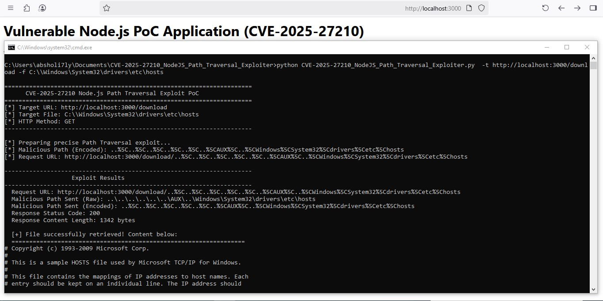

# CVE-2025-27210_NodeJS_Path_Traversal_Exploiter

Proof of Concept CVE-2025-27210, a precise Path Traversal vulnerability affecting Node.js applications running on Microsoft Windows. This vulnerability leverages the specific way Windows handles reserved device file names (e.g., AUX, CON, NUL) when combined with directory traversal sequences (../) within file paths processed by functions like path.join() or path.normalize().


```
python CVE-2025-27210_NodeJS_Path_Traversal_Exploiter.py  -t http://localhost:3000/download -f C:\\Windows\System32\drivers\etc\hosts
```

--------------------------------------------------------------------------------

--------------------------------------------------------------------------------
.jpg)
